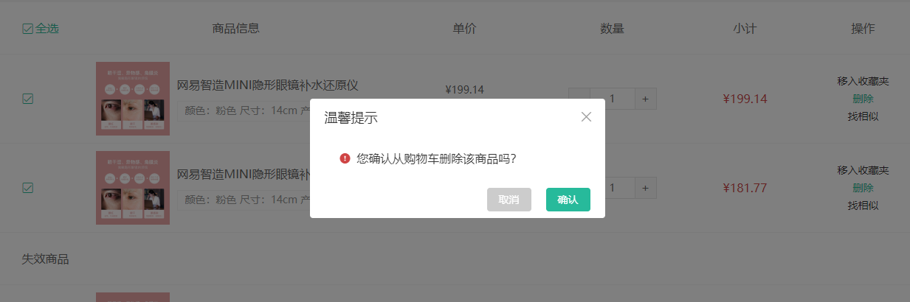

# 封装确认框组件

::: tip 目标
这一小节，我们的目标是封装确认框组件

示例如下:


:::

::: warning 步骤

1. 创建确认框组件, 编写布局代码
2. 在确认框组件中，编写样式代码
3. 在确认框组件中，声明属性title和content
4. 在购物车组件中调用，展示确认框组件的UI效果
5. 将确认弹出框组件封装成函数调用的形式
6. 实现弹框中的取消和确定逻辑
7. 实现删除购物车商品前和用户进行确认
8. 升级 Confirm 的方法返回Promise
9. 为弹层添加动画
:::

::: info 体验

* **Step.1：创建确认框组件, 编写布局代码**

```html
<template>
  <div class="xtx-confirm">
    <div class="wrapper">
      <div class="header">
        <h3>温馨提示</h3>
        <a href="JavaScript:" class="iconfont icon-close-new"></a>
      </div>
      <div class="body">
        <i class="iconfont icon-warning"></i>
        <span>您确认从购物车删除该商品吗？</span>
      </div>
      <div class="footer">
        <Button size="mini" type="gray">取消</Button>
        <Button size="mini" type="primary">确认</Button>
      </div>
    </div>
  </div>
</template>

```

* **Step.2：在确认框组件中，编写样式代码**

```css
@import "@/assets/styles/variable.css";
.xtx-confirm {
  position: fixed;
  left: 0;
  top: 0;
  width: 100%;
  height: 100%;
  z-index: 8888;
  /* background: rgba(0, 0, 0, 0.5); */
  background: rgba(0, 0, 0, 0);
  transition: all 0.4s;
}
.xtx-confirm.fade {
  background: rgba(0, 0, 0, 0.5);
}
.xtx-confirm .wrapper {
  width: 400px;
  background: #fff;
  border-radius: 4px;
  position: absolute;
  top: 50%;
  left: 50%;
  /* transform: translate(-50%, -50%); */
  transition: all 0.4s;
  transform: translate(-50%, -60%);
  opacity: 0;
}
.xtx-confirm .wrapper.fade {
  transform: translate(-50%, -50%);
  opacity: 1;
}

.xtx-confirm .wrapper .header,
.xtx-confirm .wrapper .footer {
  height: 50px;
  line-height: 50px;
  padding: 0 20px;
}
.xtx-confirm .wrapper .body {
  padding: 20px 40px;
  font-size: 16px;
}
.xtx-confirm .wrapper .body .icon-warning {
  color: var(--price-color);
  margin-right: 3px;
  font-size: 16px;
}
.xtx-confirm .wrapper .footer {
  text-align: right;
}
.xtx-confirm .wrapper .footer .xtx-button {
  margin-left: 20px;
}
.xtx-confirm .wrapper .header {
  position: relative;
}
.xtx-confirm .wrapper .header h3 {
  font-weight: normal;
  font-size: 18px;
}
.xtx-confirm .wrapper .header a {
  position: absolute;
  right: 15px;
  top: 15px;
  font-size: 20px;
  width: 20px;
  height: 20px;
  line-height: 20px;
  text-align: center;
  color: #999;
}
.xtx-confirm .wrapper .header a:hover {
  color: #666;
}
```

* **Step.3：在确认框组件中，声明属性title和content**

```html
<script setup>
import Button from "../Button/Button.vue";
const props = defineProps({
  title: {
    type: String,
    default: "温馨提示",
  },
  content: {
    type: String,
    default: "",
  }
});
</script>
```

```html
<div class="header">
  <h3>{{ title }}</h3>
  <a
    href="JavaScript:"
    class="iconfont icon-close-new"
    @click="onCancelButtonClick"
  ></a>
</div>
<div class="body">
  <i class="iconfont icon-warning"></i>
  <span>{{ content }}</span>
</div>
```

* **Step.4：在购物车组件中调用，展示确认框组件的UI效果**

```html
<Confirm title="测试标题" content="测试内容" />
```

* **Step.5：将确认弹出框组件封装成函数调用的形式**

```js
import XtxConfirm from "./Confirm.vue";
// 2. 从 vue中导出两个方法
import { createVNode, render } from "vue";

// 3. 创建 装 confirm组件的 容器
const container = document.createElement("div");
document.body.appendChild(container);

// 4. 导出并渲染组件
export default ({ title = "温馨提示", content }) => {
    const vNode = createVNode(XtxConfirm, {
      title,
      content,
    });
    // 通过 render 把虚拟dom 变成真实dom 添加到容器中去
    render(vNode, container);
};

```

* **Step.6：实现弹框中的取消和确定逻辑**

```html
<script setup>
import Button from "../Button/Button.vue";
const props = defineProps({
  title: {
    type: String,
    default: "温馨提示",
  },
  content: {
    type: String,
    default: "",
  },
  onSureButtonClick: {
    type: Function,
    default: () => {},
  },
  onCancelButtonClick: {
    type: Function,
    default: () => {},
  },
});
</script>
```

```js
import XtxConfirm from "./Confirm.vue";
// 2. 从 vue中导出两个方法
import { createVNode, render } from "vue";

// 3. 创建 装 confirm组件的 容器
const container = document.createElement("div");
document.body.appendChild(container);

// 4. 导出并渲染组件
export default ({ title = "温馨提示", content, onSureButtonClick, onCancelButtonClick }) => {
  
    const onCancelButtonClickHandler = () => {
      onCancelButtonClick()
      render(null, container); 
    };
    const onSureButtonClickHandler = () => {
      onSureButtonClick()
      render(null, container);
    };

    const vNode = createVNode(XtxConfirm, {
      title,
      content,
      onSureButtonClick: onSureButtonClickHandler,
      onCancelButtonClick: onCancelButtonClickHandler,
    });

    // 通过 render 把虚拟dom 变成真实dom 添加到容器中去
    render(vNode, container);

};

```

* **Step.7：实现删除购物车商品前和用户进行确认**

```js
// 删除商品
const deleteGoodsOfCartBySkuId = (skuId) => {
  Confirm({
    content: "您确定要删除该商品吗?",
    onSureButtonClick: () => {
        // 调用删除方法
    },
  });
};
```

* **Step.8：升级 Confirm 的方法返回Promise**

```js
import XtxConfirm from "./Confirm.vue";
// 2. 从 vue中导出两个方法
import { createVNode, render } from "vue";

// 3. 创建 装 confirm组件的 容器
const container = document.createElement("div");
document.body.appendChild(container);

// 4. 导出并渲染组件
export default ({ title = "温馨提示", content }) => {
  return new Promise((resolve, reject) => {
    const onCancelButtonClickHandler = () => {
      // 执行离场动画
      reject();
      render(null, container);
    };
    const onSureButtonClickHandler = () => {
      resolve();
      render(null, container);
    };

    const vNode = createVNode(XtxConfirm, {
      title,
      content,
      onSureButtonClick: onSureButtonClickHandler,
      onCancelButtonClick: onCancelButtonClickHandler,
    });

    // 通过 render 把虚拟dom 变成真实dom 添加到容器中去
    render(vNode, container);

  
  });
};

```

* **Step.9：为弹层添加动画**

```js
import XtxConfirm from "./Confirm.vue";
// 2. 从 vue中导出两个方法
import { createVNode, render } from "vue";

// 3. 创建 装 confirm组件的 容器
const container = document.createElement("div");
document.body.appendChild(container);

// 4. 导出并渲染组件
export default ({ title = "温馨提示", content }) => {
  return new Promise((resolve, reject) => {
    const onCancelButtonClickHandler = () => {
      // 执行离场动画
      vNode.el.classList.remove("fade");
      vNode.el.children[0].classList.remove("fade");
      reject();
      setTimeout(() => {
        render(null, container);
      }, 400);
    };
    const onSureButtonClickHandler = () => {
      resolve();
      render(null, container);
    };

    const vNode = createVNode(XtxConfirm, {
      title,
      content,
      onSureButtonClick: onSureButtonClickHandler,
      onCancelButtonClick: onCancelButtonClickHandler,
    });

    // 通过 render 把虚拟dom 变成真实dom 添加到容器中去
    render(vNode, container);

    // 执行入场动画
    setTimeout(() => {
      vNode.el.classList.add("fade");
      vNode.el.children[0].classList.add("fade");
    }, 400);
  });
};

```

:::

::: danger 总结

* 【重点】
* 【难点】
* 【注意点】
:::
