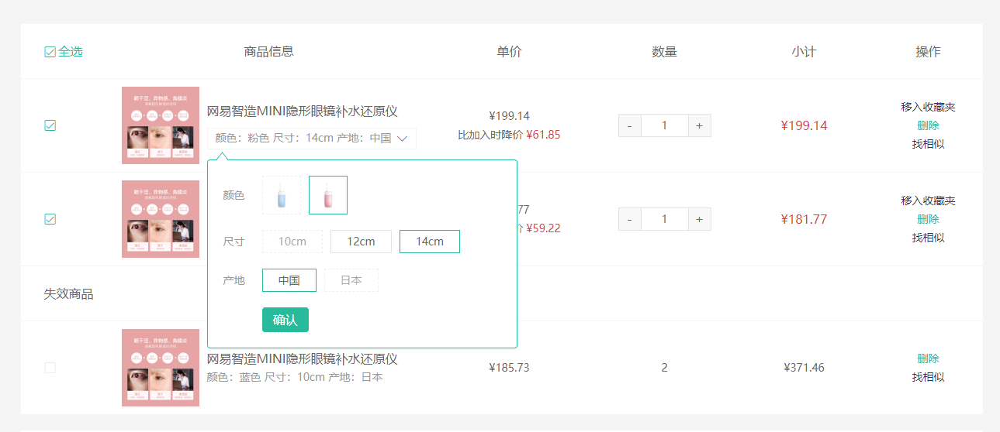

# 购物车-规格数据渲染-未登录

::: tip 目标
这一小节，我们的目标是实现购物车页面中规格数据的渲染，规格测试：1369155859933827074

示例如下:


:::

::: warning 步骤

1. 创建购物车规格组件, 编写布局代码
2. 在购物车规格组件中，编写样式代码
3. 在购物车页面组件中调用购物车规格组件
4. 实现规格选择弹层的显示隐藏效果
5. 在调用购物车规格组件时传入默认显示的规格信息
6. 创建用于获取规格信息的API接口函数 (供用户选择的规格选项数据、所有可组合的规格组合)
7. 在购物车页面组件中调用购物车规格组件时传递商品的 skuId
8. 在规格弹框弹出时发送请求获取规格组件所需数据 (skuId、specs、skus)
9. 在购物车规格组件中调用真正的规格组件并传递规格信息数据
:::

::: info 体验

* **Step.1：创建购物车规格组件, 编写布局代码**

```html
<template>
  <div class="cart-sku">
    <div class="attrs">
      <span class="ellipsis">颜色：粉色 尺寸：14cm 产地：中国</span>
      <i class="iconfont icon-angle-down"></i>
    </div>
    <div class="layer">
      <div class="loading"></div>
    </div>
  </div>
</template>

```

* **Step.2：在购物车规格组件中，编写样式代码**

```css
@import "@/assets/styles/variable.css";
.cart-sku {
  height: 28px;
  border: 1px solid #f5f5f5;
  padding: 0 6px;
  position: relative;
  margin-top: 10px;
  display: inline-block;
}
.cart-sku .attrs {
  line-height: 24px;
  display: flex;
}
.cart-sku .attrs span {
  max-width: 230px;
  font-size: 14px;
  color: #999;
}
.cart-sku .attrs i {
  margin-left: 5px;
  font-size: 14px;
}
.cart-sku .layer {
  position: absolute;
  left: -1px;
  top: 40px;
  z-index: 10;
  width: 400px;
  border: 1px solid var(--price-color);
  box-shadow: 2px 2px 4px #e6faf6;
  background: #fff;
  border-radius: 4px;
  font-size: 14px;
  padding: 20px;
}
.cart-sku .layer::before {
  content: "";
  width: 12px;
  height: 12px;
  border-left: 1px solid var(--price-color);
  border-top: 1px solid var(--price-color);
  position: absolute;
  left: 12px;
  top: -8px;
  background: #fff;
  transform: scale(0.8, 1) rotate(45deg);
}
.cart-sku .layer .loading {
  height: 224px;
  background: url(@/assets/images/loading.gif) no-repeat center;
}
```

* **Step.3：在购物车页面组件中调用购物车规格组件**

```html
<CartSku />
```

* **Step.4：实现规格选择弹层的显示隐藏效果**

```js
// 控制规格弹层的显示和隐藏
const visible = ref(false);
// 获取弹层容器
const target = ref(null);
// 显示
const show = () => {
  visible.value = true;
};
// 隐藏
const hide = () => {
  visible.value = false;
};
// 切换
const toggle = () => {
  visible.value ? hide() : show();
};
// 在规格外部点击时
onClickOutside(target, () => {
  // 如果规格弹框是显示的, 就让他隐藏
  visible.value && hide();
});
```

```html
<div class="cart-sku" ref="target">
  <div class="attrs" @click="toggle">
    <span class="ellipsis">颜色：粉色 尺寸：14cm 产地：中国</span>
    <i class="iconfont icon-angle-down"></i>
  </div>
  <div class="layer" v-if="visible">
    <div class="loading"></div>
  </div>
</div>
```

* **Step.5：在调用购物车规格组件时传入默认显示的规格信息**

```html
<CartSku :attrsText="goods.attrsText" />
```

* **Step.6：创建用于获取规格信息的API接口函数 (供用户选择的规格选项数据、所有可组合的规格组合)**

```js

/**
 * 根据skuId获取规格信息 (供用户选择的规格选项数据、所有可组合的规格组合)
 * @param skuId
 * @return {Promise}
 */
export const getSkuInfoBySkuId = (skuId) => {
  return request.get(`/goods/sku/${skuId}`);
};

```

* **Step.7：在购物车页面组件中调用购物车规格组件时传递商品的 skuId**

```js
const props = defineProps({
  attrsText: {
    type: String,
    default: "",
  },
  skuId: {
    type: String,
    default: "",
  },
});
```

* **Step.8：在规格弹框弹出时发送请求获取规格组件所需数据 (skuId、specs、skus)**

```js
// 供用户选择的规格选项数据 所有可组合的规格组合
    const specsAndSkus = ref(null);
    // sku 数据的加载状态
    const loadingSku = ref(false);
    // 显示
    const show = async () => {
        // 显示弹层
      visible.value = true;
      // 更新加载状态
      loadingSku.value = true;
      // 获取 sku 数据
      let data = await getSkuInfoBySkuId(props.skuId);
      // 存储sku数据
      specsAndSkus.value = data.result;
      // 更新加载状态
      loadingSku.value = false;
    };
```

* **Step.9：在购物车规格组件中调用真正的规格组件并传递规格信息数据**

```html
<div class="loading" v-if="loadingSku"></div>
<GoodsSku v-if="!loadingSku && specsAndSkus" :skuId="skuId" :specs="specsAndSkus.specs" :skus="specsAndSkus.skus" />
```

:::

::: danger 总结

* 【重点】
* 【难点】
* 【注意点】
:::
