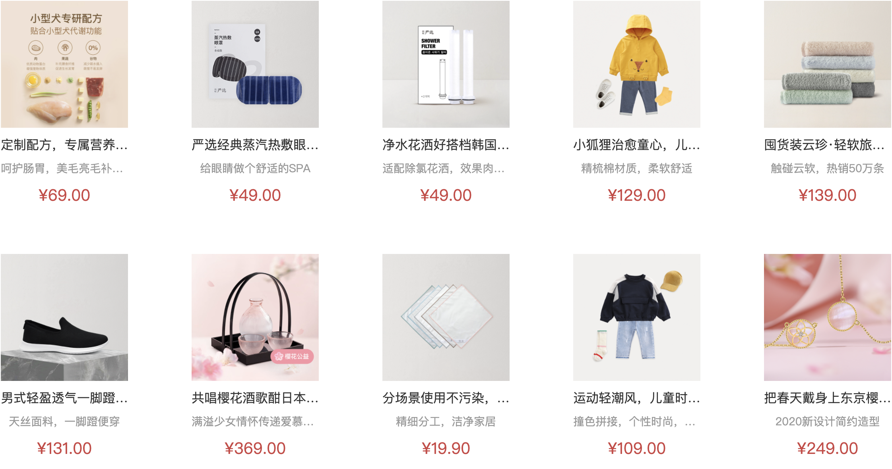

# 二级分类-商品列表渲染

::: tip 目标
这一小节，我们的目标是 渲染商品列表组件

示例如下:


:::

::: warning 步骤

1. 在商品列表组件(GoodsList)中，编写布局代码
2. 在商品列表组件(GoodsList)中，编写样式代码
3. 在`SubCategoryPage`中调用商品列表组件
4. 创建用于获取商品列表数据的API方法
5. 在`SubCategoryPage` 中调用接口获取商品数据
6. 使用获取到的商品列表数据渲染组件模板
7. 实现路由更新重新获取商品列表数据
:::

::: info 体验

* **Step.1：在商品列表组件(GoodsList)中，编写布局代码**

```html
<script setup>
defineProps({
  goods: {
    type: Array,
    default: () => [],
  },
});
</script>

<template>
  <ul>
    <li v-for="i in 20" :key="i">
      <GoodsItem :goods="{}" />
    </li>
  </ul>
</template>
```

* **Step.2：在商品列表组件(GoodsList)中，编写样式代码**

```css
ul {
  display: flex;
  flex-wrap: wrap;
  padding: 0 5px;
}

ul li {
  margin-right: 20px;
  margin-bottom: 20px;
}

ul li:nth-child(5n) {
  margin-right: 0;
}
```

* **Step.3：在`SubCategoryPage`中调用商品列表组件**

```html
<!-- 条件过滤组件 -->
<SubFilter  />
<div class="goods-list">
  <!-- 商品排序组件 -->
  <SubSort />
</div>
<!-- 商品展示组件 -->
<GoodsList  />

```

* **Step.4：创建用于获取商品列表数据的API方法**

```js
// categoryAPI.js
/**
 * 获取商品列表
 * @param params 分类id、筛选条件、排序条件、分页信息
 * @return {Promise}
 */
export function readGoodsReq(params) {
  return request.post("/category/goods", params);
}

```

* **Step.5：在`SubCategoryPage` 中调用接口获取商品数据**

```js
function useGoods() {
  // 获取路由信息对象
  const route = useRoute();
  // 用于存储商品数据
  const result = ref(null);
  // 用于存储请求参数
  let reqParams = ref({
    categoryId: route.params.id,
  });
  // 用于获取商品数据 (初始进入页面, 筛选条件变化, 排序条件变化都要调用 getGoods)
  const getGoods = () => {
    // 获取商品数据
    getGoodsReq(reqParams.value).then((data) => {
      result.value = data.result;
    });
  };
  // 监听请求参数变化, 重新获取数据
  watch(
    () => reqParams.value,
    () => {
      getGoods();
    },
    {
      // 初始进入页面获取商品数据
      immediate: true
    }
  );
  return { result };
}
```

* **Step.6：使用获取到的商品列表数据渲染组件模板**

```html
<!-- 商品列表区块 -->
<GoodsList :goods="result.items" v-if="result" />
```

```html
<!-- GoodsList.vue -->
<li v-for="item in goods" :key="item.id">
  <GoodsItem :goods="item" />
</li>
```

* **Step.7：实现路由更新重新获取商品列表数据**

```js
// 路由更新, 更新请求参数中的分类id
onBeforeRouteUpdate((to) => {
  reqParams.value = { categoryId: to.params.id };
});
```

:::

::: danger 总结

* 【重点】
* 【难点】
* 【注意点】
:::
