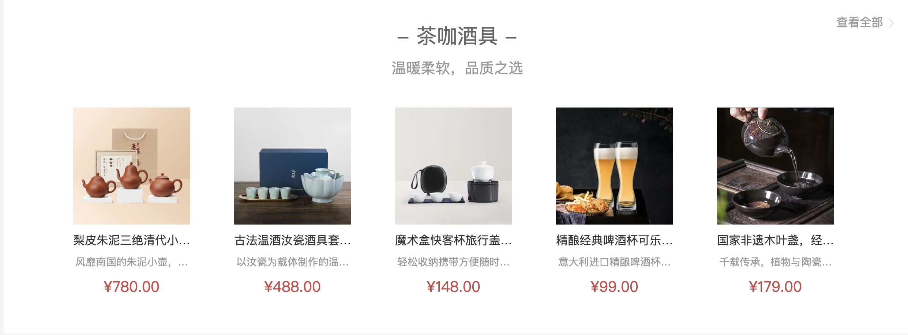

# 一级分类-商品推荐

::: tip 目标
这一小节，我们的目标是实现一级分类页面中的商品推荐

示例如下:

:::

::: warning 步骤

1. 创建商品推荐组件(`RecommendGoods`),编写布局代码
2. 在`RecommendGoods`组件中，编写样式代码
3. 在`categoryAPI.js`中，定义获取分类数据的接口方法
4. 根据数据，获取一级分类信息，并渲染商品推荐组件
5. 创建`GoodsItem`商品组件，编写布局代码
6. 在`GoodsItem`商品组件中，编写样式代码
7. 渲染`GoodsItem`商品组件  
8. 当本路由参数发生更新时, 重新获取一级分类信息
:::

::: info 体验

* **Step.1：创建商品推荐组件(`RecommendGoods`),编写布局代码**

```html
<template>
  <div class="ref-goods">
    <div class="head">
      <h3>- 海鲜 -</h3>
      <p class="tag">温暖柔软，品质之选</p>
      <XtxMore />
    </div>
    <div class="body">
      <GoodsItem v-for="i in 5" :key="i" />
    </div>
  </div>
</template>
```

* **Step.2：在`RecommendGoods`组件中，编写样式代码**

```css
.ref-goods {
  background-color: #fff;
  margin-top: 20px;
  position: relative;
}

.ref-goods h3 {
  font-size: 28px;
  color: #666;
  font-weight: normal;
  text-align: center;
  line-height: 100px;
}

.ref-goods .head .xtx-more {
  position: absolute;
  top: 20px;
  right: 20px;
}

.ref-goods .head .tag {
  text-align: center;
  color: #999;
  font-size: 20px;
  position: relative;
  top: -20px;
}

.ref-goods .body {
  display: flex;
  justify-content: flex-start;
  flex-wrap: wrap;
  padding: 0 65px 30px;
}
```

* **Step.3：在`categoryAPI.js`中，定义获取分类数据的接口方法**

```js
/**
 * 根据一级分类ID获取一级分类下的具体信息
 * @param id 一级分类ID
 * @return {Promise}
 */
export const readCategoryById = (id) => {
  return request.get("/category", {
    params: {
      id
    },
  });
};
```

* **Step.4：根据数据，获取一级分类信息，并渲染商品推荐组件**

```js
// useGoodsRecommend.js
import { ref } from "vue";
import { readCategoryById } from "../../api/categoryAPI"

// 存储一级分类具体信息
const category = ref(null);

const readCategory = (id) => {
  // 获取一级分类并存储一级分类
  readCategoryById(id).then(({ data: res, status: status }) => {
    if (status === 200) {
      category.value = res.result;
    }
  });
}

export { category,readCategory };
```

```html
<script setup>
import GoodsItem from '../GoodsItem/GoodsItem.vue';
import {onMounted} from "vue"
import { category,readCategory } from "./useGoodsRecommend"
import { useRoute } from "vue-router"
// 获取路由信息对象
const route = useRoute();
onMounted(()=>{
  readCategory(route.params.id);
})


</script>
<template>
  <div class="ref-goods" v-for="item in category?.children" :key="item.id">
    <div class="head">
      <h3>- {{item.name}} -</h3>
      <p class="tag">{{item.saleProperties}}</p>
      <More />
    </div>
    <div class="body">
      <!-- 具体商品 -->
    </div>
  </div>
</template>
```

* **Step.5：创建`GoodsItem`商品组件，编写布局代码**

```html
<template>
  <RouterLink to="/" class="goods-item">
    
    <p class="name ellipsis">红功夫 麻辣小龙虾 19.99/500g 实惠到家</p>
    <p class="desc ellipsis">火锅食材</p>
    <p class="price">¥19.99</p>
  </RouterLink>
</template>
```

* **Step.6：在`GoodsItem`商品组件中，编写样式代码**

```css
@import "@/assets/styles/variable.css";

.goods-item {
  display: block;
  width: 220px;
  padding: 20px 30px;
  text-align: center;
  transition: all .5s;
}

.goods-item:hover {
  transform: translate3d(0, -3px, 0);
  box-shadow: 0 3px 8px rgba(0, 0, 0, 0.2);
}


.goods-item img {
  width: 160px;
  height: 160px;
}

.goods-item p {
  padding-top: 10px;
}

.goods-item .name {
  font-size: 16px;
}

.goods-item .desc {
  color: #999;
  height: 29px;
}

.goods-item .price {
  color: price;
  font-size: 20px;
}
```

* **Step.7：渲染`GoodsItem`商品组件**

```html
<!-- GoodsRecommend.vue -->
<div class="body">
  <!-- 具体商品 -->
   <GoodsItem :goods="subitem" v-for="subitem in item.goods" :key="subitem.id" />
</div>
```

```html
<script setup>
defineProps({
  goods: {
    type: Object,
    default: () => ({})
  }
})
</script>
<template>
  <RouterLink to="/" class="goods-item">
    
    <p class="name ellipsis">{{goods.name}}</p>
    <p class="desc ellipsis">{{goods.desc}}</p>
    <p class="price">¥{{goods.price}}</p>
  </RouterLink>
</template>
```

* **Step.8：当本路由参数发生更新时, 重新获取一级分类信息**

```html
<script setup>
import GoodsItem from '../GoodsItem/GoodsItem.vue';
import {onMounted} from "vue"
import { onBeforeRouteUpdate } from "vue-router"
import { category,readCategory } from "./useGoodsRecommend"
import { useRoute } from "vue-router"
// 获取路由信息对象
const route = useRoute();

onBeforeRouteUpdate((to) => {
  readCategory(to.params.id);
})

```

:::

::: danger 总结

* 【重点】
* 【难点】
* 【注意点】
:::
