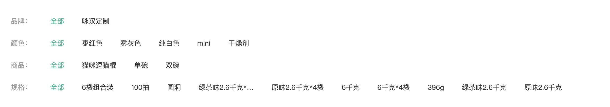

# 二级分类-筛选组件-数据渲染

::: tip 目标
这一小节，我们的目标是实现二级分类筛选区域数据渲染

示例如下:

:::

::: warning 步骤

1. 创建筛选区域组件(`SubFilter`), 编写布局代码
2. 在`SubFilter`中编写样式代码
3. 在二级分类页面组件中调用筛选区域组件
4. 创建用于获取筛选信息的 API 接口
5. 在 `SubFilter` 组件中获取筛选条件数据
6. 渲染`SubFilter` 组件模板
:::

::: info 体验

* **Step.1：创建筛选区域组件(`SubFilter`), 编写布局代码**

```html
<template>
  <!-- 筛选区 -->
  <div class="sub-filter">
    <div class="item" v-for="i in 4" :key="i">
      <div class="head">品牌：</div>
      <div class="body">
        <a href="javascript:">全部</a>
        <a href="javascript:" v-for="i in 4" :key="i">小米</a>
      </div>
    </div>

     <div class="item" v-for="i in 4" :key="i">
      <div class="head">颜色：</div>
      <div class="body">
        <a href="javascript:">全部</a>
        <a href="javascript:" >黑色</a>
         <a href="javascript:" >蓝色</a>
      </div>
    </div>
  </div>
</template>
```

* **Step.2：在`SubFilter`中编写样式代码**

```css
@import "@/assets/styles/variable.css";

.sub-filter {
  background-color: #fff;
  padding: 25px;
}

.sub-filter .item {
  display: flex;
  line-height: 40px;
}

.sub-filter .item .head {
  width: 80px;
  color: #999;
}

.sub-filter .item .body {
  flex: 1;
}

.sub-filter .item .body a {
  margin-right: 36px;
  transition: all 0.3s;
  display: inline-block;
}

.sub-filter .item .body a.active,
.sub-filter .item .body a:hover {
  color: var(--primary-color);
}
```

* **Step.3：在二级分类页面组件中调用筛选区域组件**

```html
<template>
  <Layout>
    <div class="container">
      <Bread>
       <!-- ...省略代码 -->
      </Bread>
      <!-- 筛选区域 -->
      <SubFilter/>
    </div>
  </Layout>
</template>
```

* **Step.4：创建用于获取筛选信息的 API 接口**

```js
/**
 * 根据二级分类id获取筛选条件
 * @param id 二级分类id
 * @return {Promise}
 */
 export function readFilterById(id) {
  return request.get("/category/sub/filter", {
    params: {
      id
    },
  });
}
```

* **Step.5：在 `SubFilter` 组件中获取筛选条件数据**

```js
// 导入接口方法
import { readFilterById } from "@/api/categoryAPI";
// 导入 声明响应式变量的方法
import { ref } from "vue";

// 存储筛选条件变量
export const filters = ref(null);

// 获取筛选条件数据方法
export const readFilter = (id) => {
  // 调用接口方法获取数据
  readFilterById(id).then(({ data: res, status: status }) => {
    if (status === 200) {
      // 在品牌中添加一个 全部选项
      res.result.brands.unshift({ id: "all", name: "全部" });
      // 在u其他筛选条件中添加 一个 全部 选项
      res.result.saleProperties.forEach((item) => {
        // console.log(item);
        item.properties.unshift({ id: "all", name: "全部" });
      });
      // 把处理
      filters.value = res.result;
    }
  });
};

```

* **Step.6：渲染`SubFilter` 组件模板**

```html
<script setup>
import { onMounted } from "vue";
import { useRoute } from "vue-router";
// 导入 筛选条件数据 获取筛选条件数据的方法
import { filters, readFilter } from "./useSubFilter";

// 当dom挂载完,
onMounted(() => {
  // 获取路由信息对象
  const route = useRoute();
  // 调用获取筛选条件的方法 通过路由信息对象拿到 id值
  readFilter(route.params.id);
});
</script>

<template>
  <!-- 筛选区 -->
   <!-- 筛选区 -->
  <div class="sub-filter" v-if="filters && !filtersLoading">
    <div class="item">
      <div class="head">品牌：</div>
      <div class="body">
        <a
          href="javascript:"
          v-for="item in filters?.brands"
          :key="item.id"
          >{{ item.name }}</a
        >
      </div>
    </div>

    <div class="item" v-for="item in filters?.saleProperties" :key="item.id">
      <div class="head">{{ item.name }}：</div>
      <div class="body">
        <a
          href="javascript:"
          v-for="subitem in item?.properties"
          :key="subitem.id"
          >{{ subitem.name }}</a
        >
      </div>
    </div>
  </div>
</template>
```

:::

::: danger 总结

* 【重点】
* 【难点】
* 【注意点】
:::
