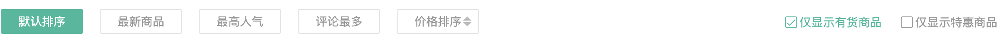

# 二级分类-排序组件

::: tip 目标
这一小节，我们的目标是实现排序组件基础布局、实现排序组件的排序参数选择

示例如下:

:::

::: warning 步骤

1. 在排序组件(SubSort)中，编写布局代码
2. 在排序组件(SubSort)中，编写样式代码
3. 在 `SubCategoryPage` 组件中调用排序组件
4. 声明用于存储排序条件的状态
5. 声明用于收集排序条件的方法
6. 在组件中使用该方法
7. 为排序按钮添加选中效果
:::

::: info 体验

* **Step.1：在排序组件(SubSort)中，编写布局代码**

```html
<template>
  <div class="sub-sort">
    <div class="sort">
      <a href="javascript:">默认排序</a>
      <a href="javascript:">最新商品</a>
      <a href="javascript:">最高人气</a>
      <a href="javascript:">评论最多</a>
      <a href="javascript:">
        价格排序
        <i class="arrow up"></i>
        <i class="arrow down"></i>
      </a>
    </div>
    <div class="check">
      <XtxCheckbox>仅显示有货商品</XtxCheckbox>
      <XtxCheckbox>仅显示特惠商品</XtxCheckbox>
    </div>
  </div>
</template>
```

* **Step.2：在排序组件(SubSort)中，编写样式代码**

```css
@import "@/assets/styles/variable.css";

.sub-sort {
  height: 80px;
  display: flex;
  align-items: center;
  justify-content: space-between;
}

.sub-sort .sort {
  display: flex;
}

.sub-sort .sort a {
  height: 30px;
  line-height: 28px;
  border: 1px solid #e4e4e4;
  padding: 0 20px;
  margin-right: 20px;
  color: #999;
  border-radius: 2px;
  position: relative;
  transition: all 0.3s;
}

.sub-sort .sort a.active {
  background: var(--primary-color);
  border-color: var(--primary-color);
  color: #fff;
}

.sub-sort .sort a .arrow {
  position: absolute;
  border: 5px solid transparent;
  right: 8px;
}

.sub-sort .sort a .arrow.up {
  top: 3px;
  border-bottom-color: #bbb;
}

.sub-sort .sort a .arrow.up.active {
  border-bottom-color: var(--primary-color);
}

.sub-sort .sort a .arrow.down {
  top: 15px;
  border-top-color: #bbb;
}

.sub-sort .sort a .arrow.down.active {
  border-top-color: var(--primary-color);
}

.sub-sort .check .xtx-checkbox {
  margin-left: 20px;
  color: #999;
}
```

* **Step.3：在 `SubCategoryPage` 组件中调用排序组件**

```html
<!-- 商品区块 -->
<div class="goods-list">
  <!-- 商品排序 -->
  <SubSort />
</div>
<script>
import SubSort from "@/views/category/components/SubSort";
export default {
  components: { SubSort }
}
</script>
<style scoped lang="less">
.goods-list {
  background: #fff;
  padding: 0 25px;
  margin-top: 25px;
}
</style>
```

* **Step.4：声明用于存储排序条件的状态**

  无论是筛选条件还是排序条件, 最终都是服务于商品列表的, 当用户点击筛选条件或者排序条件后, 都要向服务器端发送请求获取筛选结果和排序结果。
  
  也就是说, 我们要将用户选择的筛选条件和排序条件通过请求参数的方式发送给服务器端, 这样服务器端才能基于我们的请求参数响应给我们所需的数据. 所以接下来我们要做的事情就是组织排序请求参数, 当用户点击按钮更改排序方式时, 同步排序请求参数.

  | sortField |     |     |
  | --- | --- | --- |
  | publishTime | 最新商品 | String |
  | orderNum | 最高人气 | String |
  | price | 价格排序 | String |
  | evaluateNum | 评论最多 | String |
  
  | sortMethod |     |     |
  | --- | --- | --- |
  | asc | 升序  | String |
  | desc (默认) | 倒序  | String |
  
  | inventory | 是否只显示有货商品 | Boolean |
  | --- | --- | --- |
  
  | onlyDiscount | 是否只显示特惠商品 | Boolean |
  | --- | --- | --- |

  ```js
  // 用于存储排序条件
  const sortParams = ref({
    // 排序字段
    sortField: "",
    // 排序方法
    sortMethod: "desc",
    // 是否只显示有货商品
    inventory: false,
    // 是否只显示特惠商品
    onlyDiscount: false,
  }); 
  ```

* **Step.5：声明用于收集排序条件的方法**

  ```js
  const updateSortParams = (target) => {
    // 更新筛选条件
    sortParams.value = { ...sortParams.value, ...target };
    // 将筛选条件传递到父组件
    emit("onSortParamsChanged", sortParams.value);
  };
  ```

* **Step.6：在组件中使用该方法**

  ```html
  <a @click="updateSortParams({ sortField: '', sortMethod: 'desc' })">默认排序</a>
  <a @click="updateSortParams({ sortField: 'publishTime' })">最新商品</a>
  <a @click="updateSortParams({ sortField: 'orderNum' })">最高人气</a>
  <a @click="updateSortParams({ sortField: 'evaluateNum' })">评论最多</a>
  <a @click="updateSortParams({ sortField: 'price', sortMethod: sortParams.sortMethod === 'desc' ? 'asc' : 'desc' } )">
    价格排序
    <i class="arrow up"></i>
    <i class="arrow down"></i>
  </a>
  <XtxCheckbox
    v-model="sortParams.inventory"
    @update:modelValue="updateSortParams({ inventory: $event })"
  >仅显示有货商品</XtxCheckbox>
  <XtxCheckbox
    v-model="sortParams.onlyDiscount"
    @update:modelValue="updateSortParams({ onlyDiscount: $event })"
  >仅显示特惠商品</XtxCheckbox>
  ```

* **Step.7：为排序按钮添加选中效果**

  ```html
  <a :class="{ active: sortParams.sortField === '' }">默认排序</a>
  <a :class="{ active: sortParams.sortField === 'publishTime' }">最新商品</a>
  <a :class="{ active: sortParams.sortField === 'orderNum' }">最高人气</a>
  <a :class="{ active: sortParams.sortField === 'evaluateNum' }">评论最多</a>
  <a>
    价格排序
    <i :class="{ active: sortParams.sortMethod === 'asc' }"></i>
    <i :class="{ active: sortParams.sortMethod === 'desc' }"></i>
  </a>
  ```

:::

::: danger 总结

* 【重点】
* 【难点】
* 【注意点】
:::
