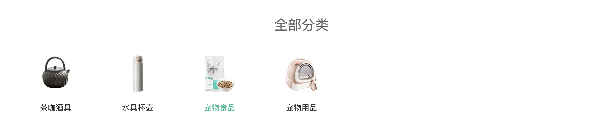

# 一级分类-展示二级分类

::: tip 目标
这一小节，我们的目标是渲染分类列表组件`全部分类`

示例如下:

:::

::: warning 步骤

1. 在`components`中创建`SubCategoryList`组件，添加布局代码
2. 在`SubCategoryList`组件中，添加样式代码
3. 在`TopCategory`中，使用分类列表组件,从已有的面包屑数据中获取对应的二级分类数据
4. 使用已有数据渲染全部二级分类列表组件
:::

::: info 体验

* **Step.1：在`components`中创建`SubCategoryList`组件，添加布局代码**

  ```html
  <template>
    <div class="sub-list">
      <h3>全部分类</h3>
      <ul>
        <li v-for="i in 6" :key="i">
          <a href="javascript:">
            
            <p>空调</p>
          </a>
        </li>
      </ul>
    </div>
  </template>
  ```

* **Step.2：在`SubCategoryList`组件中，添加样式代码**

  ```css
  @import "@/assets/styles/variable.css";

  .sub-list {
    margin-top: 20px;
    background-color: #fff;
  }

  .sub-list h3 {
    font-size: 28px;
    color: #666;
    font-weight: normal;
    text-align: center;
    line-height: 100px;
  }

  .sub-list ul {
    display: flex;
    padding: 0 32px;
    flex-wrap: wrap;
  }

  .sub-list ul li {
    width: 168px;
    height: 160px;
  }

  .sub-list ul li a {
    text-align: center;
    display: block;
    font-size: 16px;
  }

  .sub-list ul li a img {
    width: 100px;
    height: 100px;
  }

  .sub-list ul li a p {
    line-height: 40px;
  }

  .sub-list ul li a:hover {
    color: var(--primary-color);
  }
  ```

* **Step.3：在`TopCategory`中，使用分类列表组件,获取二级分类数据**

  ```js
  <SubCategoryList :subCategories="topCate.children"  v-if="topCate" />
  ```

* **Step.4：使用已有数据渲染全部二级分类列表组件**

  ```html
  <script setup>
  defineProps({
    subCategories: {
      type: Array
    }
  })
  </script>
  <template>
    <div class="sub-list">
      <h3>全部分类</h3>
      <ul v-if="subCategories">
        <li v-for="item in subCategories" :key="item.id">
          <a href="javascript:">
            
            <p>{{item.name}}</p>
          </a>
        </li>
      </ul>
    </div>
  </template>
  ```

:::

::: danger 总结

* 【重点】
* 【难点】
* 【注意点】
:::
