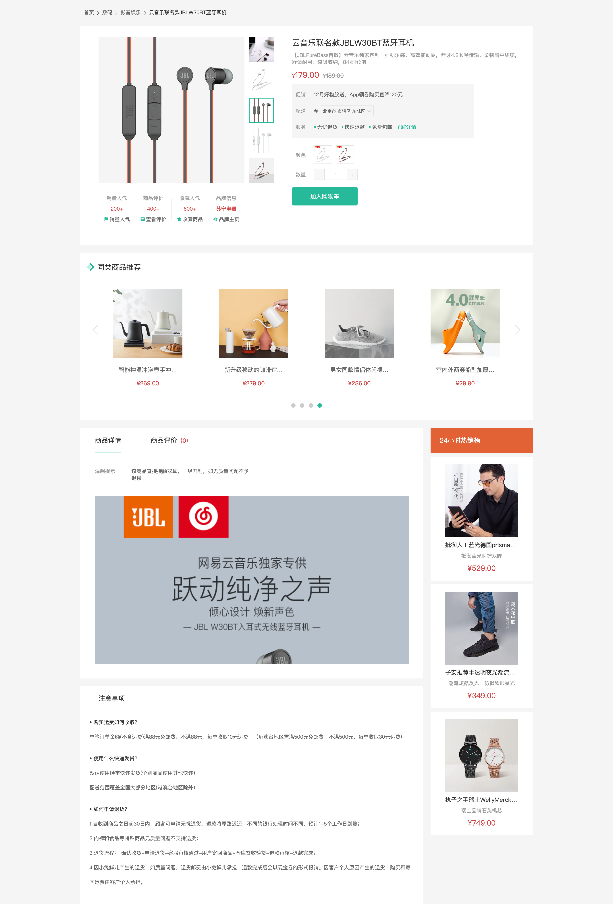

# 基础布局

::: tip 目标
这一小节，我们的目标是创建商品详情页面组件，搭建布局结构, 创建商品详情页面组件路由规则

示例如下:

:::

::: warning 步骤

1. 在`views/GoodsDetail`组件中，编写布局代码
2. 在`GoodsDetail`组件中，编写样式代码
3. 创建商品推荐组件组件(GoodsRelevant), 实现基础布局
4. 添加商品详情页面的路由规则
5. 在商品组件中添加商品链接
:::

::: info 体验

* **Step.1：在`views/GoodsDetail`组件中，编写布局代码**

```html
<script setup>
import DefaultLayout from "../DefaultLayout/DefaultLayout.vue";
import GoodsRelevant from "./GoodsRelevant/GoodsRelevant.vue";
</script>
<template>
  <DefaultLayout>
    <div class="xtx-goods-page">
      <div class="container">
        <!-- 面包屑 -->
        <Bread>
          <BreadItem path="/">首页</BreadItem>
          <BreadItem path="/">手机</BreadItem>
          <BreadItem path="/">华为</BreadItem>
          <BreadItem path="/">p30</BreadItem>
        </Bread>
        <!-- 商品信息 -->
        <div class="goods-info">
          <!-- 左侧 -->
          <div class="media"></div>
          <!-- 右侧 -->
          <div class="spec"></div>
        </div>
        <!-- 商品推荐 -->
        <GoodsRelevant></GoodsRelevant>

        <!-- 商品详情 -->
        <div class="goods-footer">
          <div class="goods-article">
            <!-- 商品+评价 -->
            <div class="goods-tabs"></div>
            <!-- 注意事项 -->
            <div class="goods-warn"></div>
          </div>
          <!-- 24热榜 -->
          <div class="goods-aside"></div>
        </div>
      </div>
    </div>
  </DefaultLayout>
</template>
```

* **Step.2：在`GoodsDetail`组件中，编写样式代码**

```css
.goods-info {
  min-height: 600px;
  background: #fff;
  display: flex;
}
.goods-info .media {
  width: 580px;
  height: 600px;
  padding: 30px 50px;
}
.goods-info .spec {
  flex: 1;
  padding: 30px 30px 30px 0;
}
.goods-footer {
  display: flex;
  margin-top: 20px;
}
.goods-footer .goods-article {
  width: 940px;
  margin-right: 20px;
}
.goods-footer .goods-aside {
  width: 280px;
  min-height: 1000px;
}
.goods-tabs {
  min-height: 600px;
  background: #fff;
}
.goods-warn {
  min-height: 600px;
  background: #fff;
  margin-top: 20px;
}
```

* **Step.3：创建商品推荐组件组件(GoodsRelevant), 实现基础布局**

```html
<template>
  <div class="goods-relevant"></div>
</template>
```

```css
.goods-relevant {
  background: #fff;
  min-height: 460px;
  margin-top: 20px;
}
```

* **Step.4：添加商品详情页面的路由规则**

```js
const GoodsDetailPage = () => import("@/views/goods/GoodsDetailPage");

const routes = [
  {
    path: "/goods/:id",
    component: GoodsDetailPage,
  },
];
```

* **Step.5：在商品组件中添加商品链接**

```html
<!-- views/category/GoodsItem.vue -->
<RouterLink :to="`/goods/${goods.id}`" class="goods-item"></RouterLink>
```

:::

::: danger 总结

* 【重点】
* 【难点】
* 【注意点】
:::
