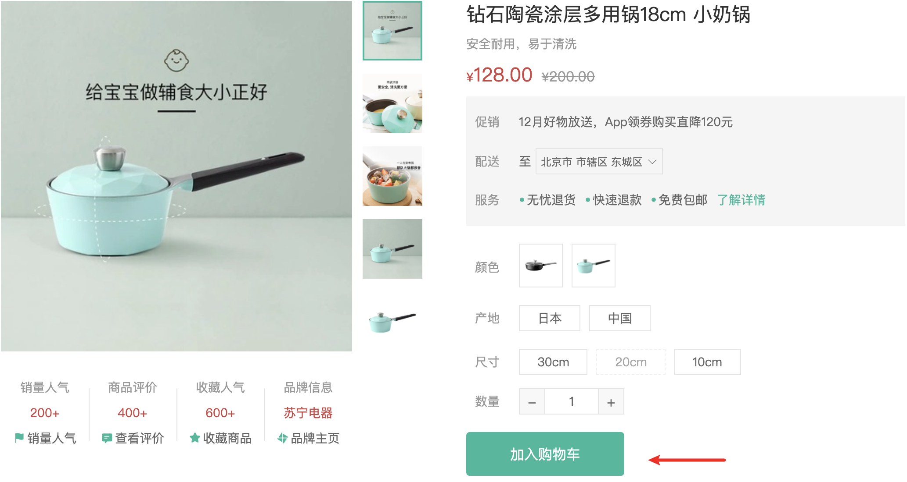

# 按钮组件

::: tip 目标
这一小节，我们的目标是封装一个通用的按钮组件

尺寸(size): 大(large)、中(middle)、小(small)、超小(mini)

类型(type): 默认(default)、主要(primary)、次要(plain)、灰色(gray)

示例如下:


:::

::: warning 步骤

1. 在`Button`组件中编写布局代码
2. 在`Button`组件中编写样式代码
3. 在商品详情页面组件中调用
:::

::: info 体验

* **Step.1：在`Button`组件中编写布局代码**

```html
<script setup>
defineProps({
  size: {
      type: String,
      default: "middle",
    },
    type: {
      type: String,
      default: "default",
    },
})
</script>
<template>
  <button class="xtx-button ellipsis" :class="[size, type]">
    <slot></slot>
  </button>
</template>
```

* **Step.2：在`Button`组件中编写样式代码**

```css
@import "@/assets/styles/variable.css";
.xtx-button {
  appearance: none;
  outline: none;
  background: #fff;
  text-align: center;
  border: 1px solid transparent;
  border-radius: 4px;
  cursor: pointer;
}
.xtx-button a {
  display: block;
  width: 100%;
  height: 100%;
}
/* 控制按钮尺寸 */
.large {
  width: 240px;
  height: 50px;
  font-size: 16px;
}
.middle {
  width: 180px;
  height: 50px;
  font-size: 16px;
}
.small {
  width: 100px;
  height: 32px;
  font-size: 14px;
}
.mini {
  width: 60px;
  height: 32px;
  font-size: 14px;
}
/* 控制按钮类型 */
.default {
  border-color: #e4e4e4;
  color: #666;
}
.primary {
  border-color: var(--primary-color);
  background: var(--primary-color);
  color: #fff;
}
.plain {
  border-color: var(--primary-color);
  color: var(--primary-color);
  background: #e6faf6;
}
.gray {
  border-color: #ccc;
  background: #ccc;
  color: #fff;
}
```

* **Step.3：在商品详情页面组件中调用**

```html

<div class="spec">
  <Button type="primary" :style="{'margin-top': '20px'}">加入购物车</XtxButton>
</div>
```

:::

::: danger 总结

* 【重点】
* 【难点】
* 【注意点】
:::
