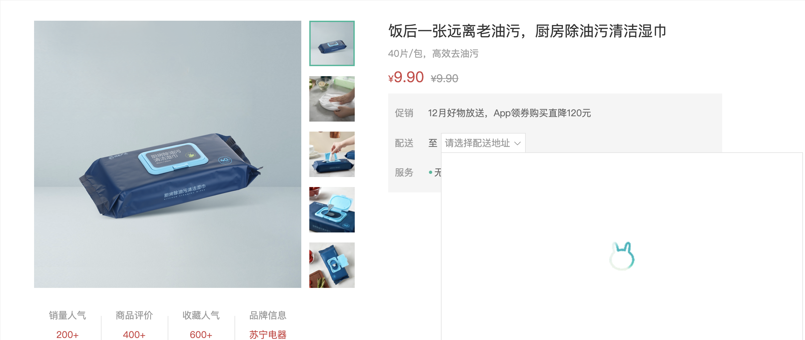

# 城市选择组件-获取数据

::: tip 目标
这一小节，我们的目标是实现城市选择组件中城市数据的获取, 加载过程的提示效果

示例如下:

:::

::: warning 步骤

1. 获取城市数据并添加缓存
2. 添加加载等待提示的结构和样式
3. 优化 loading 图片展示效果
:::

::: info 体验

* **Step.1：获取城市数据并添加缓存**

```js
import { ref } from "vue";
import { onClickOutside } from "@vueuse/core";
import axios from "axios";

export default {
  name: "XtxCity",
  setup() {
    // 用于存储城市数据
    const cityData = ref(null);
    // 显示下拉菜单
    const show = () => {
      // 获取城市数据
      getCityData().then((data) => {
        // 存储城市数据
        cityData.value = data;
      });
      // 显示下拉菜单
      visible.value = true;
    };
    return { cityData };
  },
};

// 在 window 对象中缓存城市数据
window.cityData = null;

// 获取城市数据
async function getCityData() {
  // 如果window对象中已经缓存了城市数据, 从 window 对象中获取城市数据
  if (window.cityData) return window.cityData;
  // window 对象中没有城市数据, 向服务器端发送请求获取城市数据
  let response = await axios.get(
    "https://yjy-oss-files.oss-cn-zhangjiakou.aliyuncs.com/tuxian/area.json"
  );
  // 将城市数据缓存到 window 对象中, 并作为当前方法的返回值
  return (window.cityData = response.data);
}

```

注意: 在网速比较慢的情况下, 第一次打开城市组件的下拉菜单时会有空白, 因为城市数据是在打开下拉菜单的一瞬间向服务器端请求的, 有延迟, 所以造成了空白, 用户体验不好.

* **Step.2：添加加载等待提示的结构和样式**

```html
<div class="option" v-if="visible">
  <template v-if="cityData">
      <span class="ellipsis" v-for="i in 24" :key="i">北京市</span>
  </template>
  <template v-else>
      <div class="loading"></div>
  </template>
</div>
```

```css
.xtx-city .option .loading {
  height: 290px;
  width: 100%;
  background: url(@/assets/images/loading.gif) no-repeat center;
}
```

虽然以上代码实现了加载过程的 loading 提示, 但是 loading 图片也是在调用 show 方法时动态请求的, 所以 loading 图片并不能立即显示.

* **Step.3：优化 loading 图片展示效果**

将应用中小于 10kb 的图片打包为 base64 编码格式, 这样 loading 图片就可以随样式一起加载, 当调用 show 方法时, 它就可以立即显示了.

在 img 标签的 src 属性中如果填写的是图片的外链地址, 那么当代码执行到 img 标签的时候, 浏览器会动态向服务器端发送请求获取图片资源本身, 图片资源获取完成之后才能显示。

如果在 img 标签的 src 属性中填写的是图片的 base64 编码, 那么相当于将图片资源本身嵌入了 html 文件中, 当浏览器解析到 img 标签时, 图片会立即显示, 因为图片资源本身已经存在了.

解决方案： <https://cn.vitejs.dev/guide/assets.html>
:::

::: danger 总结
* 【重点】
* 【难点】
* 【注意点】
:::
