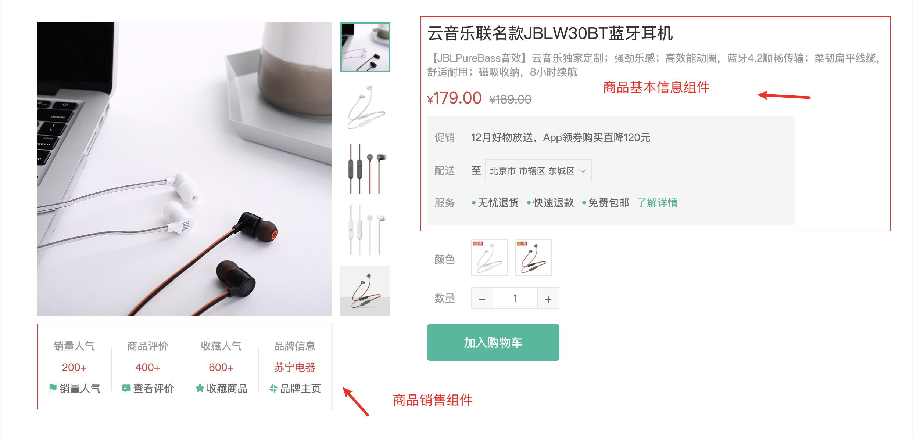

# 商品基本信息展示

::: tip 目标
这一小节，我们的目标是 创建商品基本信息组件实现基础布局并渲染商品基本信息

示例如下:

:::

::: warning 步骤

1. 在`GoodsSales`组件中，编写布局代码
2. 在`GoodsSales`组件中，编写样式代码
3. 在商品详情信息组件中调用商品销售信息组件
4. 在`GoodsInfo`组件中，编写布局代码
5. 在`GoodsInfo`组件中，编写样式代码
6. 在商品详情组件中调用 `GoodsInfo` 组件
7. 在商品基本信息组件 `GoodsInfo` 中展示商品的基本信息
:::

::: info 体验

* **Step.1：在`GoodsSales`组件中，编写布局代码**

```html
<template>
  <ul class="goods-sales">
    <li>
      <p>销量人气</p>
      <p>200+</p>
      <p><i class="iconfont icon-task-filling"></i>销量人气</p>
    </li>
    <li>
      <p>商品评价</p>
      <p>400+</p>
      <p><i class="iconfont icon-comment-filling"></i>查看评价</p>
    </li>
    <li>
      <p>收藏人气</p>
      <p>600+</p>
      <p><i class="iconfont icon-favorite-filling"></i>收藏商品</p>
    </li>
    <li>
      <p>品牌信息</p>
      <p>苏宁电器</p>
      <p><i class="iconfont icon-dynamic-filling"></i>品牌主页</p>
    </li>
  </ul>
</template>
```

* **Step.2：在`GoodsSales`组件中，编写样式代码**

```css
@import "@/assets/styles/variable.css";
.goods-sales {
  display: flex;
  width: 400px;
  align-items: center;
  text-align: center;
  height: 140px;
}
.goods-sales li {
  flex: 1;
  position: relative;
}
.goods-sales li ~ li::after {
  position: absolute;
  top: 10px;
  left: 0;
  height: 60px;
  border-left: 1px solid #e4e4e4;
  content: "";
}
.goods-sales li p:first-child {
  color: #999;
}
.goods-sales li p:nth-child(2) {
  color: var(--price-color);
  margin-top: 10px;
}
.goods-sales li p:last-child {
  color: #666;
  margin-top: 10px;
}
.goods-sales li p:last-child i {
  color: var(--primary-color);
  font-size: 14px;
  margin-right: 2px;
}
.goods-sales li p:last-child:hover {
  color: var(--primary-color);
  cursor: pointer;
}
```

* **Step.3：在商品详情信息组件中调用商品销售信息组件**

```html
<div class="media">
   <GoodsSales />
</div>
```

* **Step.4：在`GoodsInfo`组件中，编写布局代码**

```html
<template>
  <p class="g-name">2件装 粉釉花瓣心意点缀 点心盘*2 碟子盘子</p>
  <p class="g-desc">花瓣造型干净简约 多功能使用堆叠方便</p>
  <p class="g-price">
    <span>108.00</span>
    <span>199.00</span>
  </p>
  <div class="g-service">
    <dl>
      <dt>促销</dt>
      <dd>12月好物放送，App领券购买直降120元</dd>
    </dl>
    <dl>
      <dt>配送</dt>
      <dd>至</dd>
    </dl>
    <dl>
      <dt>服务</dt>
      <dd>
        <span>无忧退货</span>
        <span>快速退款</span>
        <span>免费包邮</span>
        <a href="javascript:">了解详情</a>
      </dd>
    </dl>
  </div>
</template>
```

* **Step.5：在`GoodsInfo`组件中，编写样式代码**

```css
@import "@/assets/styles/variable.css";
.g-name {
  font-size: 22px;
}
.g-desc {
  color: #999;
  margin-top: 10px;
}
.g-price {
  margin-top: 10px;
}
.g-price span::before {
  content: "¥";
  font-size: 14px;
}
.g-price span:first-child {
  color: var(--price-color);
  margin-right: 10px;
  font-size: 22px;
}
.g-price span:last-child {
  color: #999;
  text-decoration: line-through;
  font-size: 16px;
}
.g-service {
  background: #f5f5f5;
  width: 500px;
  padding: 20px 10px 0 10px;
  margin-top: 10px;
}
.g-service dl {
  padding-bottom: 20px;
  display: flex;
  align-items: center;
}
.g-service dl dt {
  width: 50px;
  color: #999;
}
.g-service dl dd {
  color: #666;
}
.g-service dl dd:last-child span {
  margin-right: 10px;
}
.g-service dl dd:last-child span::before {
  content: "•";
  color: var(--primary-color);
  margin-right: 2px;
}
.g-service dl dd:last-child a {
  color: var(--primary-color);
}
```

* **Step.6：在商品详情组件中调用 `GoodsInfo` 组件**

```html
<div class="spec">
  <GoodsInfo :goods="result" />
</div>
```

* **Step.7：在商品基本信息组件 `GoodsInfo` 中展示商品的基本信息**

```html
<p class="g-name">{{goods.name}}</p>
<p class="g-desc">{{goods.desc}}</p>
<p class="g-price">
  <span>{{goods.price}}</span>
  <span>{{goods.oldPrice}}</span>
</p>
```

:::

::: danger 总结

* 【重点】
* 【难点】
* 【注意点】
:::
