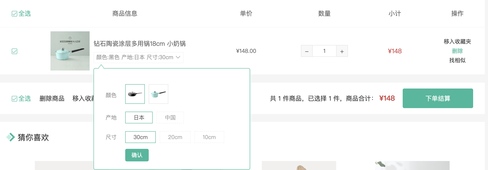

# 规格组件通讯-默认选中

::: tip 目标
这一小节，我们的目标是调用 `GoodsSku` 组件时如果传递了 skuId, 实现规格组件的默认选中效果,为什么要做这样的功能呢？
在调用 `GoodsSku` 组件时可以为组件传递 `skuId` 属性, 指定默认选中的规格组件, 该功能会在购物车组件中用到.


:::

::: warning 步骤

1. 调用 `GoodsSku` 组件时传递 skuId
2. 创建设置默认选中功能的方法
3. 在组件初始化时调用该方法
:::

::: info 体验

* **Step.1：调用 `GoodsSku` 组件时传递 skuId**

```html
<!-- Detail.vue -->
<!-- skuId 此处为测试代码, 用完即删 -->
<GoodsSku skuId="1369155864430120962" />
```

* **Step.2：创建设置默认选中功能的方法**

```js
// 设置默认选中的规格组合
function setDefaultSelected(skuId, skus, specs) {
  // 如果skuId不存在, 说明不需要设置默认选中效果
  if (!skuId) return;
  // 根据 skuId 在规格集合中查找默认选中的规格对象
  // 然后遍历其中的 specs, 返回规格名称数组
  const target = skus
    .find((sku) => sku.id === skuId)
    .specs.map((spec) => spec.valueName);
  // 循环所有的规格选项
  specs.forEach((spec) => {
    spec.values.forEach((value) => {
      if (target.includes(value.name)) {
        // 如果当前规格选项的名称在 target 数组中
        // 将它的选中状态设置为true
        value.selected = true;
      }
    });
  });
}
```

* **Step.3：在组件初始化时调用该方法**

```js
export default {
  // 默认选中的规格组合的id
  skuId: {
    type: String,
    default: ''
  }
}
setup (props) {
  // 设置默认选中的规格组合
  setDefaultSelected(props.skuId, props.skus, props.specs);
}
```

:::

::: danger 总结

* 【重点】
* 【难点】
* 【注意点】
:::
