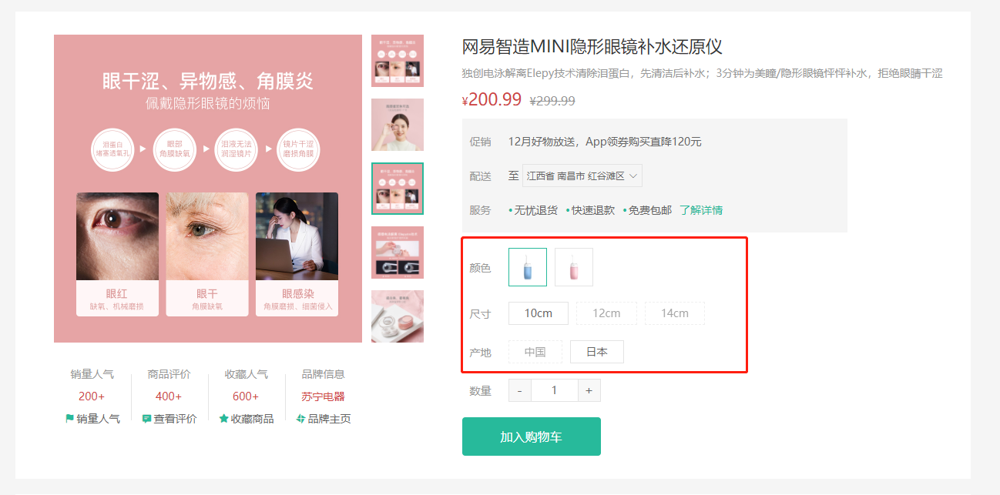

# 规格组件-基础布局

::: tip 目标
这一小节，我们的目标是实现规格组件的基础布局

示例如下:

:::

::: warning 步骤

1. 在`GoodsSku`组件中，编写布局代码
2. 在`GoodsSku`组件中，编写样式代码
3. 在商品详情页面组件中调用 `GoodsSku` 组件并传入供用户选择的规格数据
:::

::: info 体验

* **Step.1：在`GoodsSku`组件中，编写布局代码**

```html
<template>
  <div class="goods-sku">
    <dl>
      <dt>颜色</dt>
      <dd>
        
        
      </dd>
    </dl>
    <dl>
      <dt>尺寸</dt>
      <dd>
        <span class="disabled">10英寸</span>
        <span class="selected">20英寸</span>
        <span>30英寸</span>
      </dd>
    </dl>
    <dl>
      <dt>版本</dt>
      <dd>
        <span>美版</span>
        <span>港版</span>
      </dd>
    </dl>
  </div>
</template>
```

* **Step.2：在`GoodsSku`组件中，编写样式代码**

```css
@import "@/assets/styles/variable.css";
.goods-sku {
  padding-left: 10px;
  padding-top: 20px;
}
.goods-sku dl {
  display: flex;
  padding-bottom: 5px;
  align-items: center;
}
.goods-sku dl dt {
  width: 50px;
  color: #999;
}
.goods-sku dl dd {
  flex: 1;
  color: #666;
}
.goods-sku dl dd > img {
  width: 50px;
  height: 50px;
  border: 1px solid #e4e4e4;
  margin-right: 10px;
  cursor: pointer;
  margin-bottom: 10px;
}
.goods-sku dl dd > img.selected {
  border-color: var(--primary-color);
}
.goods-sku dl dd > img.disabled {
  opacity: 0.6;
  border-style: dashed;
  cursor: not-allowed;
}
.goods-sku dl dd > span {
  display: inline-block;
  height: 30px;
  line-height: 28px;
  padding: 0 20px;
  border: 1px solid #e4e4e4;
  margin-right: 10px;
  cursor: pointer;
  margin-bottom: 10px;
}
.goods-sku dl dd > span.selected {
  border-color: hello;
}
.goods-sku dl dd > span.disabled {
  opacity: 0.6;
  border-style: dashed;
  cursor: not-allowed;
}
```

* **Step.3：在商品详情页面组件中调用 `GoodsSku` 组件并传入供用户选择的规格数据**

```html
<div class="spec">
  <GoodsSku :specs="result.specs" />
</div>
```

```js
defineProps({
  specs: {
    type: Array,
    default: () => [],
  },
});
```

:::

::: danger 总结

* 【重点】
* 【难点】
* 【注意点】
:::
