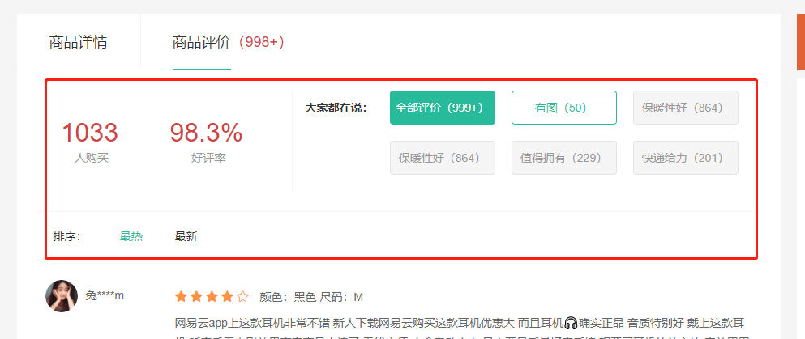

# 评价组件-头部渲染

::: tip 目标
这一小节，我们的目标是实现评价组件头部区域数据渲染

示例如下:


:::

::: warning 步骤

1. 在`GoodsComment`中，编写头部布局代码
2. 在`GoodsComment`中，编写头部样式代码
3. 创建用于获取评价组件头部数据的接口函数
4. 获取评论头部信息数据, 渲染头部信息数据
5. 实现评价头部标记的选中效果
:::

::: info 体验

* **Step.1：在`GoodsComment`中，编写头部布局代码**

```html
<template>
  <div class="goods-comment">
    <div class="head">
      <div class="data">
        <p><span>100</span><span>人购买</span></p>
        <p><span>99.99%</span><span>好评率</span></p>
      </div>
      <div class="tags">
        <div class="dt">大家都在说：</div>
        <div class="dd">
          <a href="javascript:" class="active">全部评价（1000）</a>
          <a href="javascript:">好吃（1000）</a>
          <a href="javascript:">便宜（1000）</a>
          <a href="javascript:">很好（1000）</a>
          <a href="javascript:">再来一次（1000）</a>
          <a href="javascript:">快递棒（1000）</a>
        </div>
      </div>
    </div>
    <div class="sort">
      <span>排序：</span>
      <a href="javascript:" class="active">默认</a>
      <a href="javascript:">最新</a>
      <a href="javascript:">最热</a>
    </div>
    <div class="list"></div>
  </div>
</template>
```

* **Step.2：在`GoodsComment`中，编写头部样式代码**

```css
@import "@/assets/styles/variable.css";
.goods-comment .head {
  display: flex;
  padding: 30px 0;
}
.goods-comment .head .data {
  width: 340px;
  display: flex;
  padding: 20px;
}
.goods-comment .head .data p {
  flex: 1;
  text-align: center;
}
.goods-comment .head .data p span {
  display: block;
}
.goods-comment .head .data p span:first-child {
  font-size: 32px;
  color: var(--price-color);
}
.goods-comment .head .data p span:last-child {
  color: #999;
}
.goods-comment .head .tags {
  flex: 1;
  display: flex;
  border-left: 1px solid #f5f5f5;
}
.goods-comment .head .tags .dt {
  font-weight: bold;
  width: 100px;
  text-align: right;
  line-height: 42px;
}
.goods-comment .head .tags .dd {
  flex: 1;
  display: flex;
  flex-wrap: wrap;
}
.goods-comment .head .tags .dd > a {
  width: 132px;
  height: 42px;
  margin-left: 20px;
  margin-bottom: 20px;
  border-radius: 4px;
  border: 1px solid #e4e4e4;
  background: #f5f5f5;
  color: #999;
  text-align: center;
  line-height: 40px;
}
.goods-comment .head .tags .dd > a:hover {
  border-color: hello;
  background: #e6faf6;
  color: hello;
}
.goods-comment .head .tags .dd > a.active {
  border-color: var(--primary-color);
  background: var(--primary-color);
  color: #fff;
}
.goods-comment .sort {
  height: 60px;
  line-height: 60px;
  border-top: 1px solid #f5f5f5;
  border-bottom: 1px solid #f5f5f5;
  margin: 0 20px;
  color: #666;
}
.goods-comment .sort > span {
  margin-left: 20px;
}
.goods-comment .sort > a {
  margin-left: 30px;
}
.goods-comment .sort > a.active,
.goods-comment .sort > a:hover {
  color: var(--primary-color);
}
```

* **Step.3：创建用于获取评价组件头部数据的接口函数**

```js
/**
 * 获取商品评价头部数据
 * @param id 商品id
 * @return {AxiosPromise}
 */
export const readCommentInfo = (id) => {
  // https://mock.boxuegu.com/mock/1175/goods/${id}/evaluate
  // return request.get(`/goods/${id}/evaluate`);
  return request.get(`https://mock.boxuegu.com/mock/1175/goods/${id}/evaluate`);
};
```

* **Step.4：获取评论头部信息数据, 渲染头部信息数据**

```js
import { ref } from "vue";
import { readCommentInfo } from "@/api/detailAPI";

export const useCommentHeader = () => {
  const commentData = ref(null);
  const setCommentData = (id) => {
    readCommentInfo(id).then(({ data: res, status: status }) => {
      if (status === 200) {
        res.result.tags.unshift(
          {
            title: "全部评价",
            tagCount: res.result.evaluateCount,
          },
          {
            title: "有图",
            tagCount: res.result.hasPictureCount,
          }
        );

        commentData.value = res.result;
      }
    });
  };

  return { commentData, setCommentData };
};

```

```html
 <div class="head">
      <div class="data">
        <p>
          <span>{{ commentData?.salesCount }}</span
          ><span>人购买</span>
        </p>
        <p>
          <span>{{ commentData?.praisePercent }}</span
          ><span>好评率</span>
        </p>
      </div>
      <div class="tags">
        <div class="dt">大家都在说：</div>
        <div class="dd">
          <a
            href="javascript:"
            :class="{ active: tag.title === selectedTag }"
            @click="
              setSelectedTag(tag.title);
              setReqParams({ tag: tag.title });
            "
            v-for="tag in commentData?.tags"
            :key="tag.title"
            >{{ tag.title }}（{{ tag.tagCount }}）</a
          >
      </div>
  </div>
</div>
```

* **Step.5：实现评价头部标记的选中效果**

```js
// 评价头部标记的选中效果
export const useSelectedTag = () => {
  const selectedTag = ref("全部评价");

  const setSelectedTag = (tagName) => {
    selectedTag.value = tagName;
  };

  return { selectedTag, setSelectedTag };
}; 
```

```html
 <div class="tags">
  <div class="dt">大家都在说：</div>
    <div class="dd">
      <a
        href="javascript:"
        :class="{ active: tag.title === selectedTag }"
        @click="
          setSelectedTag(tag.title);
          setReqParams({ tag: tag.title });
        "
        v-for="tag in commentData?.tags"
        :key="tag.title"
        >{{ tag.title }}（{{ tag.tagCount }}）</a
      >
  </div>
</div>
```

:::

::: danger 总结

* 【重点】
* 【难点】
* 【注意点】
:::
