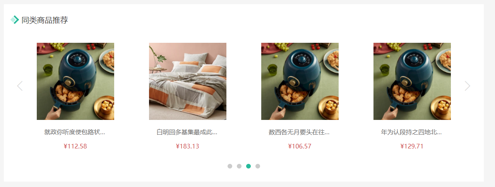

# 同类推荐组件

::: tip 目标
这一小节，我们的目标是实现同类商品推荐组件的渲染

示例如下:


:::

::: warning 步骤

1. 创建同类商品组件(GoodsRelevant), 实现基础布局
2. 在商品详情页面组件中调用同类商品组件时传入商品id
3. 创建用于获取同类商品的API接口函数
4. 在同类商品组件中调用接口函数获取数据, 并将数据结构更新为轮播图组件所需数据结构
5. 在同类商品组件中调用轮播图组件并传入轮播图所需数据
6. 在轮播图组件中添加同类商品数据所需结构并渲染同类商品数据
7. 在同类商品组件中覆盖轮播图样式, 更正轮播按钮位置
8. 动态生成同类商品组件中的标题部分: 同类商品、猜你喜欢
:::

::: info 体验

* **Step.1：创建同类商品组件(GoodsRelevant), 实现基础布局**

```html
<template>
  <div class="goods-relevant">
    <div class="header">
      <i class="icon"></i>
      <span class="title">同类商品推荐</span>
    </div>
    <!-- 此处使用改造后的xtx-carousel.vue -->
  </div>
</template>
```

```css
.goods-relevant {
  background: #fff;
  min-height: 460px;
  margin-top: 20px;
}
.goods-relevant .header {
  height: 80px;
  line-height: 80px;
  padding: 0 20px;
}
.goods-relevant .header .title {
  font-size: 20px;
  padding-left: 10px;
}
.goods-relevant .header .icon {
  width: 16px;
  height: 16px;
  display: inline-block;
  border-top: 4px solid #27BA9B;
  border-right: 4px solid #27BA9B;
  box-sizing: border-box;
  position: relative;
  transform: rotate(45deg);
}
.goods-relevant .header .icon::before {
  content: "";
  width: 10px;
  height: 10px;
  position: absolute;
  left: 0;
  top: 2px;
  background: #bcf1e6;
}
```

* **Step.2：在商品详情页面组件中调用同类商品组件时传入商品id**

```html
<!-- GoodsDetail.vue -->
<GoodsRelevant :goodsId="result.id"></GoodsRelevant>
```

```js
// GoodsRelevant.vue
export default {
  props: {
    goodsId: {
      type: String,
    },
  }
};
```

* **Step.3：创建用于获取同类商品的API接口函数**

```js
/**
 * 获取相关商品、猜你喜欢
 * @param id 商品id - 如果传了id参数表示获取相关商品数据, 如果没有传id参数表示获取猜你喜欢数据
 * @return {Promise}
 */
export function getRelevantGoods(id, limit = 16) {
  return request("/goods/relevant", "get", { id, limit });
} 
```

* **Step.4：在同类商品组件中调用接口函数获取数据, 并将数据结构更新为轮播图组件所需数据结构**

以前轮播图数据是一个数组中包含多个对象, 每个对象就是一张轮播图的信息 `[{}, {}]`

现在我们将四个商品信息看做一张轮播图信息, 所以数据结构应该是 `[[{},{},{},{}], [{},{},{},{}]]`

```js
import { getRelevantGoods } from "@/api/goods";
import { ref } from 'vue'

function useRelativeGoods (goodsId) {
  // 轮播图需要的数据结构 [[{}],[{}],[{}]]
  const carousels = ref([]);
  // 发送请求获取数据
  getRelevantGoods(goodsId).then((data) => {
    // 每页显示4条数据
    const size = 4
    // 一共有多少页数据
    // 只有计算出了一共有多少页, 才能知道循环多少次才能将数据拆分完成
    const total = Math.ceil(data.result.length / size)
    carousels.value = []
    // 组织数据结构
    for (let i = 0; i < total; i++) {
      // 第一页: 0-3 第二页: 4-7 第三页: 8-11
      // 从哪开始取: i*size
      // 取到哪 i*size + size, 由于 slice 方法在截取时不包含第二个参数位置的元素, 所以是 + size, 不是 + size - 1
      carousels.value.push(data.result.slice(i * size, i * size + size));
    }
  })
  return carousels
}

```

```js
export default {
  setup (props) {
    // 获取轮播图所需数据数据
    const carousels = useRelativeGoods(props.goodsId)
    return { carousels }
  }
} 
```

* **Step.5：在同类商品组件中调用轮播图组件并传入轮播图所需数据**

```html
<XtxCarousel :carousels="carousels" />
```

* **Step.6：在轮播图组件中添加同类商品数据所需结构并渲染同类商品数据**

```html
<!-- Carousel.vue -->
<li class="carousel-item" :class="{ fade: index === currentIndex }" v-for="(item, index) in carousels" :key="item.id">
    <!-- 如果 item 是数组就表示当前遍历的同类商品数据 -->
  <div class="slider" v-if="Array.isArray(item)">
    <router-link v-for="goods in item" :key="goods.id" :to="`/goods/${goods.id}`">
      
      <p class="name ellipsis">{{ goods.name }}</p>
      <p class="price">¥{{ goods.price }}</p>
    </router-link>
  </div>
  <!-- 如果 item 是对象就表示当前遍历的是普通轮播图数据 -->
  <router-link :to="item.hrefUrl" v-else>
      
  </router-link>
</li>
```

```css
.slider {
  display: flex;
  justify-content: space-around;
  padding: 0 40px;
}
.slider > a {
  width: 240px;
  text-align: center;
}
.slider > a img {
  padding: 20px;
  width: 230px !important;
  height: 230px !important;
}
.slider > a .name {
  font-size: 16px;
  color: #666;
  padding: 0 40px;
}
.slider > a .price {
  font-size: 16px;
  color: var(--price-color);
  margin-top: 15px;
}


```

* **Step.7：在同类商品组件中覆盖轮播图样式, 更正轮播按钮位置**

```css
.goods-relevant :deep(.xtx-carousel) {
  height: 380px;
}
.goods-relevant :deep(.xtx-carousel) .carousel-indicator {
  bottom: 30px;
}
.goods-relevant :deep(.xtx-carousel) .carousel-indicator span.active {
  background: var(--primary-color);
}
.goods-relevant :deep(.xtx-carousel) .carousel-btn {
  top: 110px;
  opacity: 1;
  background: rgba(0, 0, 0, 0);
  color: #ddd;
}
.goods-relevant :deep(.xtx-carousel) .carousel-btn i {
  font-size: 30px;
}


```

* **Step.8：动态生成同类商品组件中的标题部分: 同类商品、猜你喜欢**

```html
<span class="title">{{goodsId ? '同类商品': '猜你喜欢'}}</span>
```

:::

::: danger 总结

* 【重点】
* 【难点】
* 【注意点】
:::
