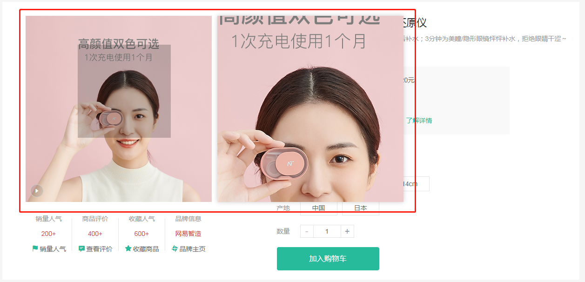

# 放大镜效果

::: tip 目标
这一小节，我们的目标是实现商品图片的放大镜效果

示例如下:

:::

::: warning 步骤

1. 在 `GoodsImages` 组件中添加大图容器
2. 在 `GoodsImages` 组件中添加镜片容器
3. 实现放大镜效果
:::

::: info 体验

* **Step.1：在 `GoodsImages` 组件中添加大图容器**

```html
<div class="goods-image">
  <div class="large" :style="{ backgroundImage: `url(${images[current]})` }"></div>
  <div class="middle"></div>
</div>
```

```css
.goods-image .large {
  position: absolute;
  top: 0;
  left: 412px;
  width: 400px;
  height: 400px;
  box-shadow: 0 0 10px rgba(0,0,0,0.1);
  background-repeat: no-repeat;
  background-size: 800px 800px;
  background-color: #f8f8f8;

}
```

* **Step.2：在 `GoodsImages` 组件中添加镜片容器**

```html
<div class="middle">
  <div class="layer"></div>
</div>
```

```css
.goods-image .middle .layer {
  width: 200px;
  height: 200px;
  background: rgba(0, 0, 0, 0.2);
  left: 0;
  top: 0;
  position: absolute;
}
```

* **Step.3：实现放大镜效果**

  1. 声明 `show` 布尔值用于控制镜片容器和大图容器的显示和隐藏
  2. 通过 `useMouseInElement` 方法获取元素和鼠标之前的关系 (鼠标是否移入到元素中、鼠标在元素中的位置)
  3. 根据鼠标是否在元素中决定大图容器和镜片容器的显示和隐藏
  4. 根据鼠标在元素中的位置计算镜片容器位置
  5. 根据镜片元素位置计算大图位置

```html
<script setup>
import { ref, watch } from "vue";
import { useMouseInElement } from "@vueuse/core";
defineProps({
  images: {
    type: Array,
    default: () => [],
  },
});

// 当前被选中元素
const currentIndex = ref(0);

// 控制镜片和大图显示与隐藏的状态
const isShow = ref(false);

// 声明监听元素
const middleElement = ref(null);

// 获取鼠标是否移入移出的布尔值
const { isOutside, elementX, elementY } = useMouseInElement(middleElement);

const layerPosition = ref({
  left: 0,
  top: 0,
});

const largePosition = ref({
  x: 0,
  y: 0,
});

watch([isOutside, elementX, elementY], () => {
  // 如果鼠标进入(false) 镜片和大图显示 否则(true)隐藏
  isShow.value = !isOutside.value;

  layerPosition.value = {
    left: elementX.value - 100,
    top: elementY.value - 100,
  };

  if (layerPosition.value.left < 0 ) {
    layerPosition.value.left = 0;
  } else if (layerPosition.value.left > 200) {
    layerPosition.value.left = 200;
  }

  if (layerPosition.value.top < 0) {
    layerPosition.value.top = 0;
  } else if (layerPosition.value.top > 200) {
    layerPosition.value.top = 200;
  }

  largePosition.value = {
    x: -layerPosition.value.left * 2,
    y: -layerPosition.value.top * 2,
  };
});
</script>

<template>
  <div class="goods-image">
    <div
      class="large"
      :style="{
        backgroundImage: `url(${images[currentIndex]})`,
        backgroundPositionX: largePosition.x + 'px',
        backgroundPositionY: largePosition.y + 'px',
      }"
      v-show="isShow"
    ></div>
    <div class="middle" ref="middleElement">
      <div
        class="layer"
        v-show="isShow"
        :style="{
          left: layerPosition.left + 'px',
          top: layerPosition.top + 'px',
        }"
      ></div>
      
    </div>
    <ul class="small">
      <li
        v-for="(item, index) in images"
        :key="item"
        @mouseenter="currentIndex = index"
        :class="{ active: currentIndex === index }"
      >
        
      </li>
    </ul>
  </div>
</template>

```

:::

::: danger 总结

* 【重点】
* 【难点】
* 【注意点】
:::
