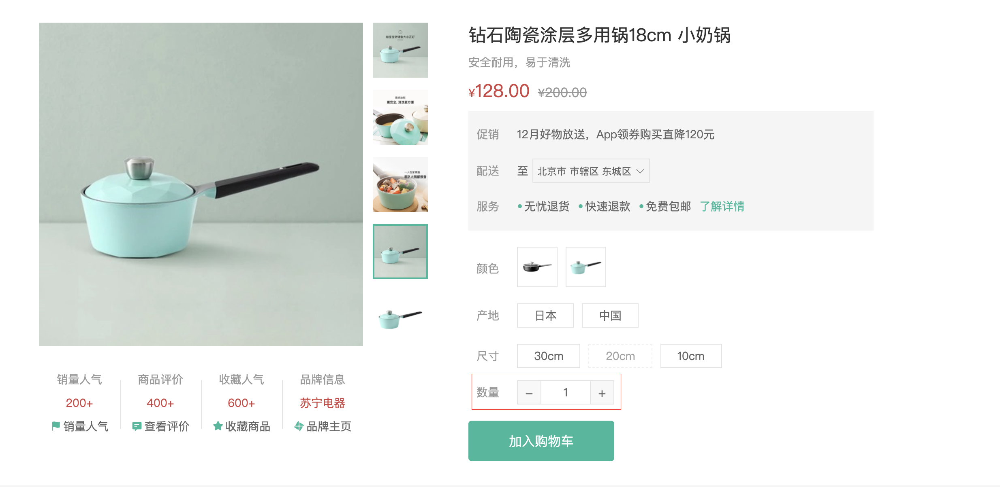

# 商品数量选择组件

::: tip 目标
这一小节，我们的目标是封装商品数量选择组件(NumberBox)

示例如下:


:::

::: warning 步骤

1. 在`components`文件夹中，创建商品数量选择组件，编写布局代码
2. 在商品数量组件中，编写样式代码
3. 实现商品数量更改的功能
4. 在商品详情页面中调用商品数量选择组件时传递相关数据
:::

::: info 体验

* **Step.1：在`components`文件夹中，创建商品数量选择组件，编写布局代码**

```html
<template>
  <div class="xtx-number-box">
    <div class="label">数量</div>
    <div class="number-box">
      <a href="javascript:">-</a>
      <input type="text" readonly value="1" />
      <a href="javascript:">+</a>
    </div>
  </div>
</template>
```

* **Step.2：在商品数量组件中，编写样式代码**

```css
.xtx-number-box {
  display: flex;
  align-items: center;
}
.xtx-number-box .label {
  width: 60px;
  color: #999;
  padding-left: 10px;
}
.xtx-number-box .number-box {
  width: 120px;
  height: 30px;
  border: 1px solid #e4e4e4;
  display: flex;
}
.xtx-number-box .number-box > a {
  width: 29px;
  line-height: 28px;
  text-align: center;
  background: #f8f8f8;
  font-size: 16px;
  color: #666;
}
.xtx-number-box .number-box > a:first-of-type {
  border-right: 1px solid #e4e4e4;
}
.xtx-number-box .number-box > a:last-of-type {
  border-left: 1px solid #e4e4e4;
}
.xtx-number-box .number-box > input {
  width: 60px;
  padding: 0 5px;
  text-align: center;
  color: #666;
}
```

* **Step.3：实现商品数量更改的功能**

```js
import { useVModel } from "@vueuse/core";
export const useNumberBox = (props, emit) => {
  const number = useVModel(props, "modelValue", emit);
  const setNumber = (step = 1) => {
    const nextNumber = number.value + step;
    if (nextNumber < 1) {
      number.value = 1;
    } else if (nextNumber > props.max) {
      number.value = props.max;
    } else {
      number.value = nextNumber;
    }
  };

  return { number, setNumber };
};

```

```js
import { useNumberBox } from "./NumberBox";
const props = defineProps({
  max: {
    type: Number,
  },
  modelValue: {
    type: Number,
  },
  label: {
    type: String,
    default: "数字",
  },
});
const { number, setNumber } = useNumberBox(props, emit);
const emit = defineEmits(["update:modelValue"]);
```

* **Step.4：在商品详情页面中调用商品数量选择组件时传递相关数据**

```html
<NumberBox label="数量" :max="result.inventory" v-model="count" />
```

:::

::: danger 总结

* 【重点】
* 【难点】
* 【注意点】
:::
