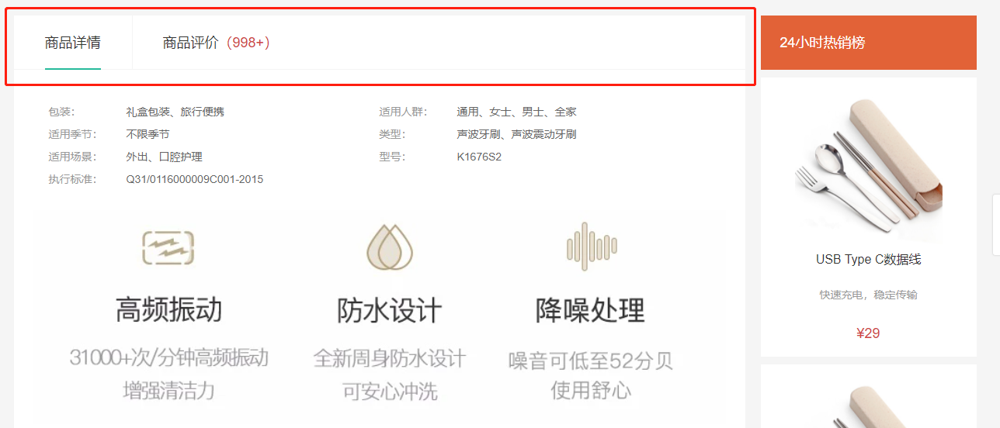

# 标签页组件

::: tip 目标
这一小节，我们的目标是实现标签页组件渲染, 标题切换效果及内容切换效果

示例如下:


:::

::: warning 步骤

1. 创建标签页组件(GoodsTab), 实现基础布局
2. 在商品详情页组件中调用标签页组件
3. 实现标签页组件中标题的切换效果
4. 实现标签页内容切换效果 (商品详情组件和商品评价组件)
:::

::: info 体验

* **Step.1：创建标签页组件, 实现基础布局**

```html
<template>
  <div class="goods-tabs">
    <nav>
      <a class="active" href="javascript:">商品详情</a>
      <a href="javascript:">商品评价<span>(500+)</span></a>
    </nav>
    <!-- 切换内容的地方 -->
  </div>
</template>
```

```css
.goods-tabs {
  min-height: 600px;
  background: #fff;
}
.goods-tabs nav {
  height: 70px;
  line-height: 70px;
  display: flex;
  border-bottom: 1px solid #f5f5f5;
}
.goods-tabs nav a {
  padding: 0 40px;
  font-size: 18px;
  position: relative;
}
.goods-tabs nav a > span {
  color: var(--price-color);
  font-size: 16px;
  margin-left: 10px;
}
.goods-tabs nav a:first-child {
  border-right: 1px solid #f5f5f5;
}
.goods-tabs nav a.active::before {
  content: "";
  position: absolute;
  left: 40px;
  bottom: -1px;
  width: 72px;
  height: 2px;
  background: var(--primary-color);
}
```

* **Step.2：在商品详情页组件中调用标签页组件**

```html
<!-- GoodsDetail.vue` -->
<div class="goods-article">
  <!-- 商品+评价 -->
  <GoodsTab />
</div>
```

* **Step.3：实现标签页组件中标题的切换效果**

```html
<template>
  <a
    @click="activeComponentName = 'GoodsDetail'"
    :class="{ active: activeComponentName === 'GoodsDetail' }"
    >商品详情</a
  >
  <a
    @click="activeComponentName = 'GoodsComment'"
    :class="{ active: activeComponentName === 'GoodsComment' }"
    >商品评价<span>(500+)</span></a
  >
</template>
<script setup>
import { ref } from 'vue'
// GoodsDetail 展示商品详细信息、GoodsComment 展示商品评论信息
const activeComponentName = ref("GoodsDetail");
}
</script>
```

* **Step.4：实现标签页内容切换效果 (商品详情组件和商品评价组件)**

```html
import GoodsDetail from "@/views/goods/components/GoodsDetail";
import GoodsComment from "@/views/goods/components/GoodsComment";

<!-- 根据组件名称动态渲染组件 -->
<component :is="activeComponentName"></component>
```

:::

::: danger 总结

* 【重点】
* 【难点】
* 【注意点】
:::
