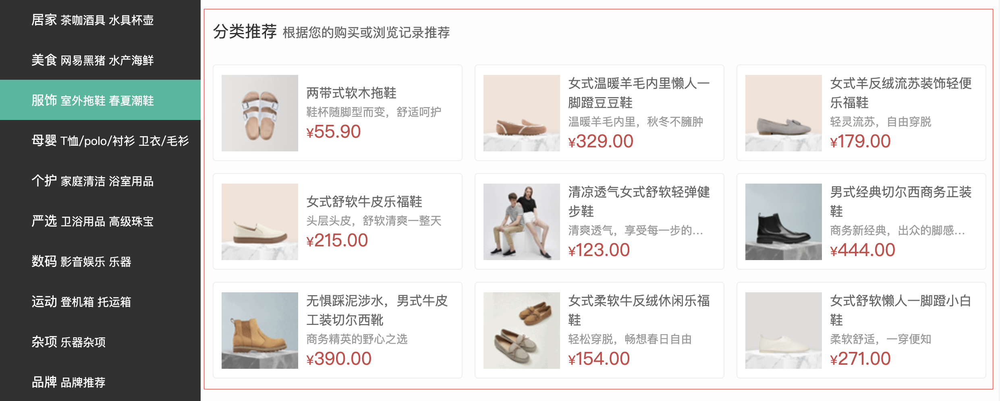

# 实现左侧分类列表商品推荐

::: tip 目标
这一小节，我们的目标是实现左侧分类弹层中的分类商品推荐基础布局及数据渲染,示例如下：


:::

::: warning 步骤

1. 在 `HomeCategory` 组件中添加弹层布局代码
2. 在 `HomeCategory` 组件中添加弹层样式代码
3. 记录用户鼠标移入的分类对象
4. 渲染当前分类推荐商品至模板
:::

::: info 体验

* **Step.1：在 `HomeCategory` 组件中添加弹层布局代码**

```html
<template>
  <div class="home-category">
    <ul class="menu">
     <!-- 代码略... -->
    </ul>
    <!-- 分类列表商品推荐 -->
    <div class="layer" v-if="current">
      <h4>
        分类商品推荐
        <small>根据您的购买或浏览记录推荐</small>
      </h4>
      <ul>
        <li v-for="goods in current.goods" :key="goods.id">
          <RouterLink to="/">
            
            <div class="info">
              <p class="name ellipsis-2">{{ goods.name }}</p>
              <p class="desc ellipsis">{{ goods.desc }}</p>
              <p class="price">
                <i>¥</i>
                {{ goods.price }}
              </p>
            </div>
          </RouterLink>
        </li>
      </ul>
    </div>
  </div>
</template>
```

* **Step.2：在 `HomeCategory` 组件中添加弹层样式代码**

```css
.layer {
  width: 990px;
  height: 500px;
  background: rgba(255, 255, 255, 0.8);
  position: absolute;
  left: 250px;
  top: 0;
  display: none;
  padding: 0 15px;
}
.layer h4 {
  font-size: 20px;
  font-weight: normal;
  line-height: 80px;
}
.layer h4 small {
  font-size: 16px;
  color: #666;
}
.layer ul {
  display: flex;
  flex-wrap: wrap;
}
.layer ul li {
  width: 310px;
  height: 120px;
  margin-right: 15px;
  margin-bottom: 15px;
  border: 1px solid #eee;
  border-radius: 4px;
  background: #fff;
}
.layer ul li:nth-child(3n) {
  margin-right: 0;
}
.layer ul li a {
  display: flex;
  width: 100%;
  height: 100%;
  align-items: center;
  padding: 10px;
}
.layer ul li a:hover {
  background: #e3f9f4;
}
.layer ul li a img {
  width: 95px;
  height: 95px;
}
.layer .info {
  padding-left: 10px;
  line-height: 24px;
  width: 190px;
}
.layer .info .name {
  font-size: 16px;
  color: #666;
}
.layer .info .desc {
  color: #999;
}
.layer .info .price {
  font-size: 22px;
  color: var(--price-color);
}
.layer .info .price i {
  font-size: 16px;
}
.home-category:hover .layer {
  display: block;
}
```

* **Step.3：记录用户鼠标移入的分类对象**

```js
const current = ref(null);
```

```html
<ul class="menu">
  <li v-for="item in menuList " :key="item.id" @mouseenter="current = item">
    <RouterLink to="/">{{ item.name }}</RouterLink>
    <RouterLink to="/" v-for="subitem in item.children" :key="subitem.id">{{ subitem.name }}</RouterLink>
  </li>
</ul>
```

* **Step.4：渲染当前分类推荐商品至模板**

```html
<!-- 分类列表商品推荐 -->
<div class="layer" v-if="current">
  <h4>
    分类商品推荐
    <small>根据您的购买或浏览记录推荐</small>
  </h4>
  <ul>
    <li v-for="goods in current.goods" :key="goods.id">
      <RouterLink to="/">
        
        <div class="info">
          <p class="name ellipsis-2">{{ goods.name }}</p>
          <p class="desc ellipsis">{{ goods.desc }}</p>
          <p class="price">
            <i>¥</i>
            {{ goods.price }}
          </p>
        </div>
      </RouterLink>
    </li>
  </ul>
</div>
```

:::

::: danger 总结

* 【重点】
* 【难点】
* 【注意点】
:::
