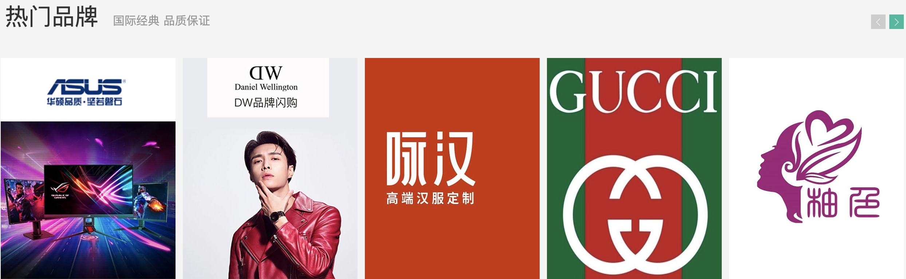

# 实现热门品牌

::: tip 目标
这一小节，我们的目标是实现热门品牌组件渲染，示例如下:

:::

::: warning 步骤

1. 在`components`文件夹中，创建`HomeBrand`组件，添加页面布局代码
2. 在`HomeBrand`组件中，添加页面样式代码
3. 在`HomeBrand`组件中，添加页面JavaScript代码
4. 在`Home`组件中，渲染`HomeBrand`组件
5. 通过数据懒加载来获取热门品牌数据
6. 渲染获取到的热门品牌数据
7. 实现热门品牌左右滚动功能
8. 实现热门品牌骨架屏效果
:::

::: info 体验

* **Step.1：在`components`文件夹中，创建`HomeBrand`组件，添加页面布局代码**

  ```html
  <template>
    <HomePanel title="热门品牌" subTitle="国际经典 品质保证">
      <template v-slot:right>
        <a href="javascript:" class="iconfont icon-angle-left prev"></a>
        <a href="javascript:" class="iconfont icon-angle-right next"></a>
      </template>
      <template v-slot:default>
        <div class="box">
          <ul class="list">
            <li v-for="i in 10" :key="i">
              <RouterLink to="/">
                
              </RouterLink>
            </li>
          </ul>
        </div>
      </template>
    </HomePanel>
  </template>
  ```

* **Step.2：在`HomeBrand`组件中，添加页面样式代码**

  ```html
  <style scoped>
  @import "@/assets/styles/variable.css";

  .home-panel {
    background: #f5f5f5;
  }

  .iconfont {
    width: 20px;
    height: 20px;
    background: #ccc;
    color: #fff;
    display: inline-block;
    text-align: center;
    margin-left: 5px;
    background-color: var(--primary-color);
  }

  .iconfont::before {
    font-size: 12px;
    position: relative;
    top: -2px;
  }

  .iconfont.disabled {
    background: #ccc;
    cursor: not-allowed;
  }

  .box {
    display: flex;
    width: 100%;
    height: 345px;
    overflow: hidden;
    padding-bottom: 40px;
  }

  .box .list {
    width: 200%;
    display: flex;
    transition: all 1s;
  }

  .box .list li {
    margin-right: 10px;
    width: 240px;
  }

  .box .list li:nth-child(5n) {
    margin-right: 0;
  }

  .box .list li img {
    width: 240px;
    height: 305px;
  }
  </style>
  ```

* **Step.3：在`HomeBrand`组件中，添加页面JavaScript代码**

  ```html
  <script setup>
  import HomePanel from "../HomePanel/HomePanel.vue";
  </script>
  ```

* **Step.4：在`Home`组件中，渲染`HomeBrand`组件**

  ```html
  <script setup>
  import Layout from "@/components/Layout/Layout.vue";
  import HomeCategory from "../../components/HomeCategory/HomeCategory.vue";
  import HomeBanner from "../../components/HomeBanner/HomeBanner.vue";
  import HomeNew from "../../components/HomeNew/HomeNew.vue";
  import HomeHot from "../../components/HomeHot/HomeHot.vue";
  import HomeBrand from "../../components/HomeBrand/HomeBrand.vue";
  </script>

  <template>
    <Layout>
      <div class="container">
        <HomeCategory />
        <HomeBanner />
      </div>
      <HomeNew />
      <HomeHot />
      <HomeBrand/>
    </Layout>
  </template>
  ```

* **Step.5：通过数据懒加载来获取热门品牌数据**

  ```js
  import { readHotBrands } from "../../api/homeAPI"
  import { useLazyData } from "../HomeNew/useHomeNew"
  const { target, result } = useLazyData(readHotBrands)
  ```

* **Step.6：渲染获取到的热门品牌数据**

  ```html
  <li v-for="item in result" :key="item.id">
    <RouterLink to="/">
      
    </RouterLink>
  </li>
  ```

* **Step.7：实现热门品牌左右滚动功能**

  ```js
  import { ref } from "vue"

  // 实现左右滚动效果
  export const  useToggleEffect = () => {
    // 切换索引
    const currentIndex = ref(0);
    // 控制切换索引
    const toggle = (step) =>{
      // 计算索引
      const nextIndex = currentIndex.value + step;
      // 控制索引返回
      if (nextIndex < 0 || nextIndex > 1) return;
      // 如果索引在正常范围内就更改索引
      currentIndex.value = nextIndex;
    }
    return {currentIndex, toggle}
  }
  ```

  ```html
  <template v-slot:right>
    <a href="javascript:" 
      @click="toggle(-1)" 
      :class="{ disabled: currentIndex === 0 }"
      class="iconfont icon-angle-left prev">
    </a>
    <a href="javascript:" 
      @click="toggle(1)" 
      :class="{ disabled: currentIndex === 1 }"
      class="iconfont icon-angle-right next">
    </a>
  </template>
  ```

  ```html
  <ul class="list" 
    :style="{transform: `translateX(${-currentIndex * 1240}px)`}">
  </ul>
  ```

* **Step.8：实现热门品牌骨架屏效果**

  ```html
  <!-- HomeBrand.vue -->
  <template #default>
    <div class="box">
      <Transition>
        <ul v-if="result" 
            class="list" 
            :style="{ transform: `translateX(${-currentIndex * 1240}px)` }">
          <li v-for="item in result" :key="item.id">
            <RouterLink to="/">
              
            </RouterLink>
          </li>
        </ul>
        <div v-else class="skeleton">
          <MenuSkeleton 
          class="item" 
          v-for="i in 5" 
          :key="i" 
          animated="scroll" 
          bg="#e4e4e4" 
          width="240px" 
          height="305px"></MenuSkeleton>
        </div>
      </Transition>
        </div>
  </template>
  ```

  ```css
  .skeleton {
    width: 100%;
    display: flex;
  }

  .skeleton .item {
    margin-right: 10px;
  }

  .skeleton .item:nth-child(5n) {
    margin-right: 0;
  }
  ```

:::

::: danger 总结

* 【重点】
* 【难点】
* 【注意点】
:::
