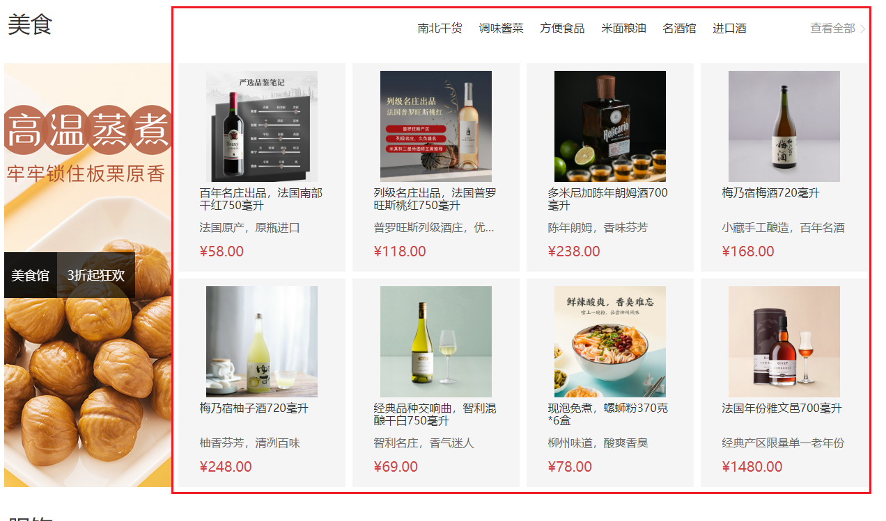

# 实现产品区块右侧

::: tip 目标
这一小节，我们的目标是实现产品区块右侧商品列表，示例如下:

:::

::: warning 步骤

1. 创建`HomeGoods`组件，并添加布局代码
2. 在`HomeGoods`组件中添加样式代码
3. 在`HomeGoods`组件中添加`props`属性
4. 在`HomeProduct`组件引入`HomeGoods`组件
5. 渲染`HomeGoods`组件的数据
:::

::: info 体验

* **Step.1：创建`HomeGoods`组件，并添加布局代码**

```html
<template>
  <div class="goods-item">
    <RouterLink to="/" class="image">
      
    </RouterLink>
    <p class="name ellipsis-2">美威 智利原味三文鱼排 240g/袋 4片装</p>
    <p class="desc ellipsis">海鲜年货</p>
    <p class="price">&yen;108.00</p>
    <div class="extra">
      <RouterLink to="/">
        <span>找相似</span>
        <span>发现现多宝贝 &gt;</span>
      </RouterLink>
    </div>
  </div>
</template>
```

* **Step.2：在`HomeGoods`组件中添加样式代码**

```css
@import "@/assets/styles/variable.css";

.goods-item {
  width: 240px;
  height: 300px;
  padding: 10px 30px;
  position: relative;
  overflow: hidden;
  border: 1px solid transparent;
  transition: all 0.5s;
  background-color: whitesmoke;
}

.goods-item .image {
  display: block;
  width: 160px;
  height: 160px;
  margin: 0 auto;
}

.goods-item .image img {
  width: 100%;
  height: 100%;
}

.goods-item p {
  margin-top: 6px;
  font-size: 16px;
}

.goods-item p.name {
  height: 44px;
}

.goods-item p.desc {
  color: #666;
  height: 22px;
}

.goods-item p.price {
  margin-top: 10px;
  font-size: 20px;
  color: var(--price-color);
}

.goods-item .extra {
  position: absolute;
  left: 0;
  bottom: 0;
  height: 86px;
  width: 100%;
  background: var(--primary-color);
  text-align: center;
  transform: translate3d(0, 100%, 0);
  transition: all 0.5s;
}

.goods-item .extra span {
  display: block;
  color: #fff;
  width: 120px;
  margin: 0 auto;
  line-height: 30px;
}

.goods-item .extra span:first-child {
  font-size: 18px;
  border-bottom: 1px solid #fff;
  line-height: 40px;
  margin-top: 5px;
}

.goods-item:hover {
  border-color: var(--primary-color);
  ;
}

.goods-item:hover .extra {
  transform: none;
}
```

* **Step.3：在`HomeGoods`组件中添加`props`属性**

```js
defineProps({
  goods: {
    type: Object
  }
})
```

* **Step.4：在`HomeProduct`组件引入`HomeGoods`组件**

```html
<ul class="goods-list" v-if="item.goods">
  <li v-for="goods in item.goods" :key="goods.id">
    <HomeGoods :goods="goods" />
  </li>
</ul>
```

* **Step.5：渲染`HomeGoods`组件的数据**

```html
<template>
  <div class="goods-item">
    <RouterLink :to="`/product/${goods.id}`" class="image">
      
    </RouterLink>
    <p class="name ellipsis-2">{{ goods.name }}</p>
    <p class="desc ellipsis">{{ goods.desc }}</p>
    <p class="price">&yen;{{ goods.price }}</p>
    <div class="extra">
      <RouterLink to="/">
        <span>找相似</span>
        <span>发现现多宝贝 &gt;</span>
      </RouterLink>
    </div>
  </div>
</template>
```

:::
