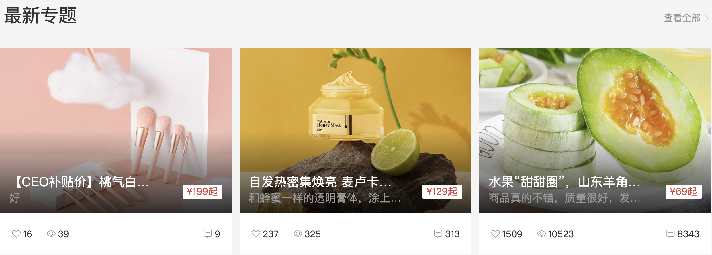

# 实现最新专题

::: tip 目标
这一小节，我们的目标是实现最新专题组件渲染，示例如下:

:::

::: warning 步骤

1. 创建`HomeSpecial`组件，并添加布局代码
2. 在`HomeSpecial`组件中添加样式代码
3. 在`HomeSpecial`组件中引入需要的组件
4. 在`Home`组件中调用`HomeSpecial`组件
5. 在`homeAPI`中声明获取数据的方法
6. 在`HomeSpecial`组件实现数据懒加载
7. 把数据渲染到`HomeSpecial`组件中
:::

::: info 体验

* **Step.1：创建`HomeSpecial`组件，并添加布局代码**

  ```html
  <template>
    <HomePanel title="最新专题">
      <template v-slot:right>
        <More />
      </template>
      <template v-slot:default>
        <div class="special-list">
          <div class="special-item" v-for="i in 3" :key="i">
            <RouterLink to="/">
              
              <div class="meta">
                <p class="title">
                  <span class="top ellipsis">看到撒娇的撒娇的凯撒就</span>
                  <span class="sub ellipsis">倒萨倒萨倒萨</span>
                </p>
                <span class="price">¥19.99起</span>
              </div>
            </RouterLink>
            <div class="foot">
              <span class="like"><i class="iconfont icon-hart1"></i>100</span>
              <span class="view"><i class="iconfont icon-see"></i>100</span>
              <span class="reply"><i class="iconfont icon-message"></i>100</span>
            </div>
          </div>
        </div>
      </template>
    </HomePanel>
  </template>
  ```

* **Step.2：在`HomeSpecial`组件中添加样式代码**

  ```css
  @import "@/assets/styles/variable.css";
  .home-panel {
    background-color: #f5f5f5;
  }
  .special-list {
    height: 380px;
    padding-bottom: 20px;
    display: flex;
    justify-content: space-between;
  }
  .special-list .special-item {
    width: 404px;
    background-color: #fff;
    transition: all .5s;
  }

  .special-list .special-item:hover {
    transform: translate3d(0, -3px, 0);
    box-shadow: 0 3px 8px rgba(0, 0, 0, 0.2);
  }
  .special-list .special-item a {
    display: block;
    width: 100%;
    height: 288px;
    position: relative;
  }
  .special-list .special-item a img {
    width: 100%;
    height: 100%;
    object-fit: cover;
  }
  .special-list .special-item a .meta {
    background-image: linear-gradient(to top, rgba(0, 0, 0, 0.8), transparent 50%);
    position: absolute;
    left: 0;
    top: 0;
    width: 100%;
    height: 288px;
  }
  .special-list .special-item a .meta .title {
    position: absolute;
    bottom: 0;
    left: 0;
    padding-left: 16px;
    width: 70%;
    height: 70px;
  }
  .special-list .special-item a .meta .title .top {
    color: #fff;
    font-size: 22px;
    display: block;
  }
  .special-list .special-item a .meta .title .sub {
    display: block;
    font-size: 19px;
    color: #999;
  }
  .special-list .special-item a .meta .price {
    position: absolute;
    bottom: 25px;
    right: 16px;
    line-height: 1;
    padding: 4px 8px 4px 7px;
    color: var(--price-color);
    font-size: 17px;
    background-color: #fff;
    border-radius: 2px;
  }
  .special-list .special-item .foot {
    height: 72px;
    line-height: 72px;
    padding: 0 20px;
    font-size: 16px;
  }
  .special-list .special-item .foot i {
    display: inline-block;
    width: 15px;
    height: 14px;
    margin-right: 5px;
    color: #999;
  }
  .special-list .special-item .foot .like,
  .special-list .special-item .foot .view {
    float: left;
    margin-right: 25px;
    vertical-align: middle;
  }
  .special-list .special-item .foot .reply {
    float: right;
    vertical-align: middle;
  }
  ```

* **Step.3：在`HomeSpecial`组件中引入需要的组件**

  ```js
  import HomePanel from '../HomePanel/HomePanel.vue';
  ```

* **Step.4：在`Home`组件中调用`HomeSpecial`组件**

  ```html
  <script setup>
  import Layout from "@/components/Layout/Layout.vue";
  // ...省略代码
  import HomeSpecial from "../../components/HomeSpecial/HomeSpecial.vue";

  </script>

  <template>
    <Layout>
      <!-- ...省略代码 -->
      <HomeProduct/>
      <HomeSpecial/>
    </Layout>
  </template>

  ```

* **Step.5：在`homeAPI`中声明获取数据的方法**

  ```js
  /**
   * 获取最新专题
   * @param {number} limit 限制请求数据的数量
   * @return {Promise<{result: Array<Special>}>}
   */
  export  const readSpecial =(limit) => {
    return request.get("/home/special",  {
      params: {
        limit
      },
    });
  }
  ```

* **Step.6：在`HomeSpecial`组件实现数据懒加载**

  ```js
  import {readSpecial} from "../../api/homeAPI"
  import {useLazyData} from "../HomeNew/useHomeNew"
  const {target, result} = useLazyData(readSpecial);
  ```

  * **Step.7：把数据渲染到`HomeSpecial`组件中**

  ```html
  <RouterLink to="/">
    
    <div class="meta">
      <p class="title">
        <span class="top ellipsis">{{ item.title }}</span>
        <span class="sub ellipsis">{{ item.summary }}</span>
      </p>
      <span class="price">¥{{ item.lowestPrice }}起</span>
    </div>
  </RouterLink>
  ```

:::

::: danger 总结

* 【重点】
* 【难点】
* 【注意点】
:::
