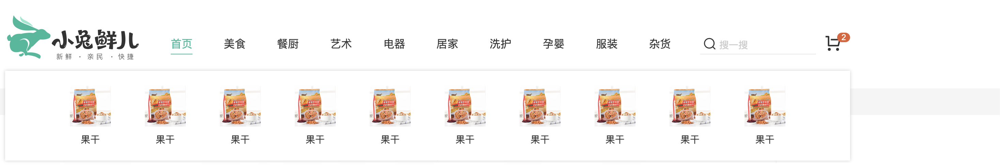

# 抽取导航组件

::: tip 目标
这一小节，我们的目标是将导航组件抽取为公共组件，完成导航下拉菜单基础布局，示例如下：


:::

::: warning 步骤

1. 在`components`文件中，创建`HeaderNav`组件,编写布局代码
2. 把关于导航组件的样式，从`AppHeader`抽取出来，添加到`HeaderNav`中
3. 在每个一级分类(li)下添加二级分类(layer)布局
4. 添加对于二级分类的样式代码
:::

::: info 体验

* **Step.1：在`components`文件中，创建`HeaderNav`组件,编写布局代码**

```html
<ul class="app-header-nav">
    <li class="home">
      <RouterLink to="/">首页</RouterLink>
    </li>
    <li>
      <a href="#">美食</a>
    </li>
    <li>
      <a href="#">餐厨</a>
    </li>
    <li>
      <a href="#">艺术</a>
    </li>
    <li>
      <a href="#">电器</a>
    </li>
    <li>
      <a href="#">居家</a>
    </li>
    <li>
      <a href="#">洗护</a>
    </li>
    <li>
      <a href="#">孕婴</a>
    </li>
    <li>
      <a href="#">服装</a>
    </li>
    <li>
      <a href="#">杂货</a>
    </li>
  </ul>
</template>
```

* **Step.2：把关于导航组件的样式，从`AppHeader`抽取出来，添加到`HeaderNav`中**

```css
.app-header-nav {
  width: 820px;
  display: flex;
  justify-content: space-around;
  padding-left: 40px;
  position: relative;
  z-index: 998;
}
.app-header-nav > li {
  margin-right: 40px;
  width: 38px;
  text-align: center;
}
.app-header-nav > li > a {
  font-size: 16px;
  line-height: 32px;
  height: 32px;
  display: inline-block;
}
.app-header-nav > li:hover > a {
  color: var(--primary-color);
  border-bottom: 1px solid var(--primary-color);
}
.app-header-nav > li:hover > .layer {
  height: 132px;
  opacity: 1;
}
```

* **Step.3：在每个一级分类(li)下添加二级分类(layer)布局**

```html
<div class="layer">
  <ul>
    <li v-for="i in 10" :key="i">
      <a href="#">
        
        <p>果干</p>
      </a>
    </li>
  </ul>
</div>
```

* **Step.4：添加对于二级分类的样式代码**

```css
.layer {
  width: 1240px;
  background-color: #fff;
  position: absolute;
  left: -200px;
  top: 56px;
  height: 0;
  overflow: hidden;
  opacity: 0;
  box-shadow: 0 0 5px #ccc;
  transition: all 0.2s 0.1s;
}
.layer ul {
  display: flex;
  flex-wrap: wrap;
  padding: 0 70px;
  align-items: center;
  height: 132px;
}
.layer ul li {
  width: 110px;
  text-align: center;
}
.layer ul li img {
  width: 60px;
  height: 60px;
}
.layer ul li p {
  padding-top: 10px;
}
.layer ul li:hover p {
  color: var(--primary-color);
}
```

:::

::: danger 总结

* 【重点】
* 【难点】
* 【注意点】
:::
