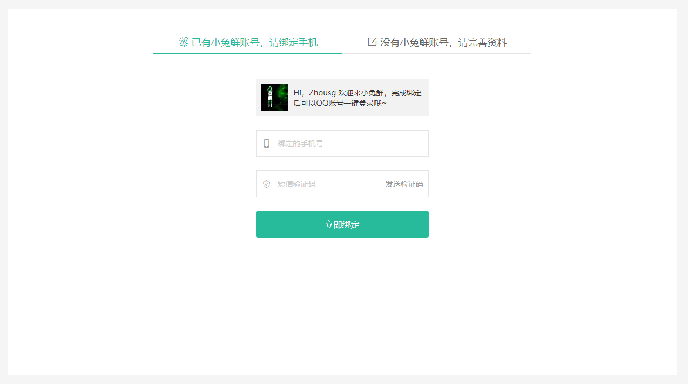

# QQ登录-绑定已有账号

::: tip 目标
这一小节，我们的目标是实现将手机号和QQ账号进行绑定

示例如下:


:::

::: warning 步骤

1. 获取用户头像和昵称
2. 表单验证
3. 获取手机验证码, 显示倒计时
4. 实现手机号和QQ号进行绑定

:::

::: info 体验

* **Step.1：获取用户头像和昵称**

```js
// 获取QQ用户昵称和头像
export const useQQUserInfo = () => {
  // 存储QQ用户昵称
  const nickname = ref(null);
  // 存储QQ用户头像
  const avatar = ref(null);

  const setNickAndAvatar = () => {
    // 获取QQ互联对象
    const QC = window.QC;
    // 检测 登录状态
    if (QC.Login.check()) {
      // 向QQ互联 网服务器中心发送请求获取QQ用户信息
      QC.api("get_user_info").success((response) => {
        console.log(response.data);
        nickname.value = response.data.nickname;
        avatar.value = response.data.figureurl_1;
      });
    }
  };

  return { nickname, avatar, setNickAndAvatar };
};
```

```js
 // 获取QQ用户昵称和头像
const { nickname, avatar } = useQQUserInfo()
```

```html
<!-- LoginCallbackBindPhone.vue -->
<div class="user-info">
  
  <p>Hi，{{nickname}} 欢迎来小兔鲜，完成绑定后可以QQ账号一键登录哦~</p>
</div>
```

* **Step.2：表单验证**

```js
// 表单验证
export const useBindPhoneValid = () => {
  // 创建表单验证对象
  const { handleSubmit } = useForm({
    validationSchema: { mobile, code },
  });

  // 手机号验证
  const {
    value: mobileField,
    errorMessage: mobileError,
    validate,
  } = useField("mobile");
  // 单独验证手机号
  const getMobileIsValidate = async () => {
    const { valid } = await validate();
    return { isValid: valid, mobile: mobileField.value };
  };
  // 验证码验证
  const { value: codeField, errorMessage: codeError } = useField("code");

  return {
    mobileField,
    mobileError,
    codeField,
    codeError,
    handleSubmit,
    getMobileIsValidate,
  };
};
```

```js
    // 获取和表单验证相关的内容
const {
  codeField,
  codeError,
  mobileField,
  mobileError,
  handleSubmit,
  getMobileIsValidate,
} = useBindPhoneValid();
    // 表单提交
// 表单提交
const onSubmitHandler = handleSubmit((value) => {
  console.log(value);
});

const getMsgCode = () => {
   getMobileIsValidate()
      .then(({ isValid, mobile }) => {
        // 如果手机号验证通过
        if (isValid) {}
      })
};
 
```

```html
<form class="xtx-form" @submit="onSubmitHandler">
  <input v-model="mobileField" placeholder="绑定的手机号"/>
  <div class="error" v-if="mobileError">{{ mobileError }}
  <input v-model="codeField" placeholder="短信验证码"/>
  <div class="error" v-if="codeError">{{ codeError }}</div>    
</form>
```

* **Step.3：获取手机验证码, 显示倒计时**

```js
/**
 * 获取手机验证码 (QQ登录, 绑定已有账号手机号)
 * @param mobile
 * @return {Promise}
 */
export const getBindMobileMsgCode = (mobile) => {
  return request.get("/login/social/code", {
    params: {
      mobile,
    },
  });
};
```

```html
<span class="code" @click="getMsgCode">{{ isActive ? `剩余${count}秒`: "发送验证码"}}</span>
```

```js
import Message from '@/components/library/Message'
import useCountDown from '../logic/countDown'
import { getBindMobileMsgCode } from "@/api/user";

// 获取倒计时
const { count, start, isActive } = useCountDown();
// 获取验证码
const getMsgCode = () => {
  getMobileIsValidate()
    .then(({ isValid, mobile }) => {
      // 如果手机号验证通过
      if (isValid && !isActive.value) return getBindMobileMsgCode(mobile);
    })
    .then(() => {
      Message({ type: "success", text: "验证码发送成功" });
      // 开启倒计时
      start(60);
    })
    .catch((error) =>
      Message({
        type: "error",
        text: `验证码发送失败 ${error.response.data.message}`,
      })
    );
};

```

* **Step.4：实现手机号和QQ号进行绑定**

```js
/**
 * QQ登录, 将手机号和QQ号进行绑定
 * @param unionId 用户的唯一标识(openid)
 * @param mobile 手机号
 * @param code 手机验证码
 * @return {Promise}
 */
export const bindMobileAndQQ = ({ unionId, mobile, code }) => {
  return request.post("/login/social/bind", { unionId, mobile, code });
};

```

```js
// LoginCallbackBindPhone.vue
import { bindMobileAndQQ } from "@/api/user";
import useLoginAfter from "@/hooks/useLoginAfter";

const props = defineProps({
  unionId: {
    type: String,
    default: "",
  },
});

// 获取登录成功的回调函数和登录失败的回调函数
const { loginSuccessful, loginFailed } = useLoginAfter();
// 表单提交方法
// 表单提交
const onSubmitHandler = handleSubmit((value) => {
  // 将手机号和QQ号进行绑定
  // 绑定成功即登录成功
  bindMobileAndQQ({ ...value, unionId: props.unionId })
    .then(loginSuccessful)
    .catch(loginFailed);
});
```

```js
// LoginCallback.vue
const unionId = ref(null);
// 获取登录用户的 appid, 就是用户的唯一标识
QC.Login.getMe((unionId) => {
  // 存储用户唯一标识
  unionId.value = openid;
})
```

```html
<!-- LoginCallback.vue` -->
<LoginCallbackBindPhone :unionId="unionId" />
```

:::

::: danger 总结

* 【重点】
* 【难点】
* 【注意点】
:::
