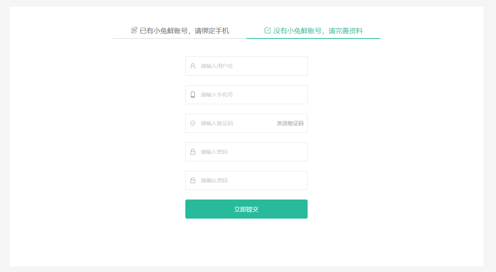

# QQ登录-绑定新注册账号

::: tip 目标
这一小节，我们的目标是实现使用新注册的站点账号绑定QQ号

示例如下:



:::

::: warning 步骤

1. 创建用于检查用户名是否已存在的API方法
2. 添加两条验证规则, 验证用户名和两次输入密码是否相同
3. 创建表单验证对象, 实现表单验证
4. 在组件的 setup 方法中获取表单验证相关信息并返回给模板使用
5. 在模板中绑定表单表单验证信息
6. 实现获取手机验证码功能
7. 完善信息(创建新账号)、绑定QQ号
:::

::: info 体验

* **Step.1：创建用于检查用户名是否已存在的API方法**

```js
/**
 * 检测用户名是否唯一
 * @param account 用户名
 * @return {Promise}
 */
export function checkUsernameIsUnique(account) {
  return request.get("/register/check", {
    params: {
      account,
    },
  });
}

```

* **Step.2：添加两条验证规则, 验证用户名和两次输入密码是否相同**

```js
import { checkUsernameIsUnique } from "@/api/loginAPI";

export async function checkUserAccount(value) {
  if (!value) return "请输入用户名";
  if (!/^[a-zA-Z]\w{5,19}$/.test(value)) return "字母开头且6-20个字符";
  // 服务端校验
  const { data: res } = await checkUsernameIsUnique(value);
  if (res.result.valid) return "用户名已存在";
  return true;
}
export function rePassword(value, { form }) {
  if (!value) return "请输入密码";
  if (!/^\w{6,24}$/.test(value)) return "密码是6-24个字符";
  // 校验密码是否一致  form表单数据对象
  if (value !== form.password) return "两次输入的密码不一致";
  return true;
}

```

* **Step.3：创建表单验证对象, 实现表单验证**

```js
// LoginCallbackBindPatch
import { useField, useForm } from "vee-validate";
import { mobile, code } from "@/utils/vee-validateSchema";
// 表单验证
export const useBindPhoneValidate = () => {
  const { handleSubmit: handleBindPhoneSubmit } = useForm({
    validationSchema: { mobile, code },
  });
  const {
    value: mobileField,
    errorMessage: mobileError,
    validate,
  } = useField("mobile");

  const { value: codeField, errorMessage: codeError } = useField("code");

 
  return {
    mobileField,
    mobileError,
    codeField,
    codeError,
    handleBindPhoneSubmit,
    getMobileIsValidate,
  };
};

```

* **Step.4：在组件的 setup 方法中获取表单验证相关信息并返回给模板使用**

```js
const {
  mobileField,
  mobileError,
  codeField,
  codeError,
  handleBindPhoneSubmit,
  getMobileIsValidate,
} = useBindPhoneValidate();


const onBindPhoneSubmit = handleBindPhoneSubmit((value) => {
 
});
```

* **Step.5：在模板中绑定表单表单验证信息**

```html
<form class="xtx-form" @submit="onSubmitHandler">
  <input v-model="accountField" placeholder="请输入用户名" />
  <div v-if="accountError">{{ accountError }}</div>
  <input v-model="mobileField" placeholder="请输入手机号" />
  <div v-if="mobileError">{{ mobileError }}</div>
  <input v-model="codeField" placeholder="请输入验证码" />
  <div class="error" v-if="codeError">{{ codeError }}</div>
  <input v-model="passwordField" placeholder="请输入密码" />
  <div v-if="passwordError">{{ passwordError }}</div>
  <input v-model="rePasswordField" placeholder="请确认密码" />
  <div v-if="rePasswordError">{{ rePasswordError }}</div>
</form>
```

* **Step.6：实现获取手机验证码功能**

导出用于获取注册时候的手机验证码API方法

```js
/**
 * 获取手机验证码 (注册)
 * @param mobile 手机号
 * @return {AxiosPromise}
 */
export function getRegisterMsgCode(mobile) {
  return request.get("/register/code", {
    params: {
      mobile,
    },
  });
}

```

创建用于单独验证手机号的验证方法

```js
// LoginCallbackBindPatch.vue

 const getMobileIsValidate = async () => {
    const { valid } = await validate();
    return { isValid: valid, mobile: mobileField.value };
  };
```

实现验证码发送功能

```html
<span class="code" @click="getMsgCode">{{ isActive ? `剩余${count}秒` : "发送验证码" }}</span>
```

```js
import { getRegisterMsgCode} from "@/api/loginAPI";
import Message from "@/components/library/Message";
import useCountDown from "@/hooks/useCountDown";

// 获取手机验证码
const getMsgCode = () => {
  // 如果倒计时正在执行, 阻止程序向下执行
  if (isActive.value) return;
  // 验证手机号
  getMobileIsValidate()
    .then(({ isValid, mobile }) => {
      // 如果手机号验证通过
      if (isValid) return getRegisterMsgCode(mobile);
    })
    .then(() => {
      Message({ type: "success", text: "验证码发送成功" });
      // 开启倒计时
      start(60);
    })
    .catch((error) =>
      Message({
        type: "error",
        text: `验证码发送失败 ${error.response.data.message}`,
      })
    );
};

```

* **Step.7：完善信息(创建新账号)、绑定QQ号**

定义用于创建新账户并绑定QQ的API接口函数

```js
/**
 * 创建新账户并绑定QQ
 * @param unionId QQ用户唯一标识
 * @param account 用户名
 * @param mobile 手机号
 * @param code 验证码
 * @param password 密码
 * @return {AxiosPromise}
 */
export function createNewAccountBindQQ({
  unionId,
  account,
  mobile,
  code,
  password,
}) {
  return request.post(`/login/social/${unionId}/complement`, {
    account,
    mobile,
    code,
    password,
  });
}
```

创建新账号、绑定QQ号、成功后跳转到首页(登录成功)

```js
import { getRegisterMsgCode, createNewAccountBindQQ } from "@/api/loginAPI";

const onSubmitHandler = handleSubmit((value) => {
  // 请求成功时的回调
  const successFn = ({ data: res, status: status }) => {
    const { profile } = storeToRefs(useUserStore());
    if (status === 200) {
      // 把用户信息存储到Store中
      profile.value = { ...profile.value, ...res.result };
      // // 判断登陆成功 跳转到首页
      router.push("/").then(() => {
        // 登录成功之后的提示信息
        Message({ type: "success", text: "登录成功" });
      });
    }
  };
  // 登陆失败时的回调
  const failFn = (error) => {
    // console.log(error.response.data.message);
    Message({ type: "error", text: error.response.data.message });
  };
  createNewAccountBindQQ({
    unionId: props.unionId,
    account: value.checkUserAccount,
    mobile: value.mobile,
    code: value.code,
    password: value.password,
  }) // 成功
    .then(successFn)
    // 失败
    .catch(failFn);
});

```

```html
<!-- login.vue -->
<LoginCallbackBindPatch :unionId="unionId" />
```

:::

::: danger 总结

* 【重点】
* 【难点】
* 【注意点】
:::
