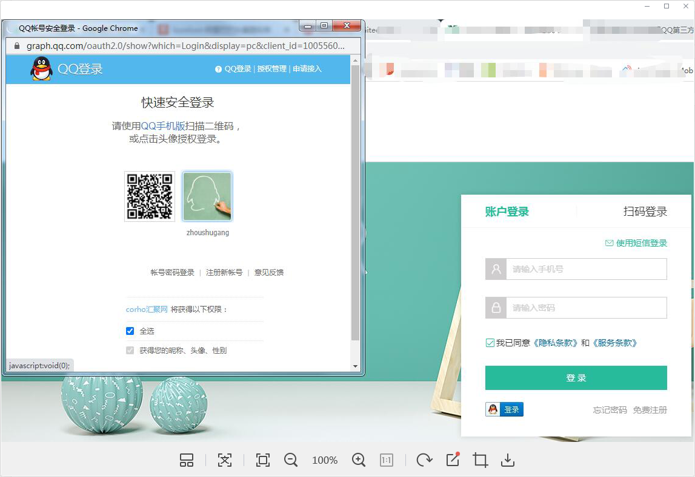

# QQ登录-创建登录按钮

::: tip 目标
这一小节，我们的目标是 生成访问QQ登录页面的链接地址
:::

::: warning 步骤

1. 在应用中的HTML模板中添加导入QQ互联的JS库文件
2. 临时使用以下代码替换写死在组件模板的中QQ登录图片
3. 在组件挂载完成后创建QQ登录按钮(临时)
4. 拷贝生成的链接地址, 创建一个新的链接标记, 填充链接地址, 包裹原有的QQ登录图片.
5. 删除在以上步骤中生成的临时代码
:::

::: info 体验

* **Step1：在应用中的HTML模板中添加导入QQ互联的JS库文件**

```html
<script src="http://connect.qq.com/qc_jssdk.js" data-appid="100556005" data-redirecturi="http://www.corho.com:8080/#/login/callback"></script>
```

* **Step2：临时使用以下代码替换写死在组件模板的中QQ登录图片**

```html
<span id="qqLoginBtn"></span>
<!--  -->
```

* **Step3：在组件挂载完成后创建QQ登录按钮(临时)**

```js
import { onMounted } from 'vue'
export default {
  setup () {
    onMounted(() => {
      window.QC.Login({
        btnId: 'qqLoginBtn'
      })
    })
  }
}
```



* **Step4：拷贝生成的链接地址, 创建一个新的链接标记, 填充链接地址, 包裹原有的QQ登录图片.**

```html
<a href="https://graph.qq.com/oauth2.0/authorize?client_id=100556005&response_type=token&scope=all&redirect_uri=http%3A%2F%2Fwww.corho.com%3A8080%2F%23%2Flogin%2Fcallback">
  
</a>
```

* **Step5：删除在以上步骤中生成的临时代码**

```html
<span id="qqLoginBtn"></span>
```

```js
onMounted(() => {
  window.QC.Login({
    btnId: 'qqLoginBtn'
  })
})
```

:::

::: danger 总结

* 【重点】
* 【难点】
* 【注意点】
:::
