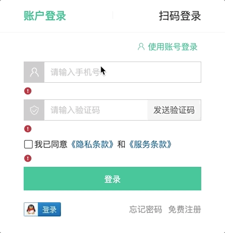

# 登录-表单组件

::: tip 目标
这一小节，我们的目标是 实现登录表单基础布局, 实现账号登录和短信登录的切换效果

示例如下:

:::

::: warning 步骤

1. 创建登录表单组件, 编写布局代码
2. 在登录表单组件中，编写样式代码
3. 在登录页面组件中调用登录表单组件
4. 实现账户登录表单和短信登录表单的切换效果
:::

::: info 体验

* **Step.1：创建登录表单组件, 编写布局代码**

```html
<template>
  <div class="account-box">
    <div class="toggle">
      <button><i class="iconfont icon-user"></i> 使用账号登录</button>
      <button><i class="iconfont icon-msg"></i> 使用短信登录</button>
    </div>
    <div class="form">
      <!-- 账户登录 -->
      <template>
        <form>
          <div class="form-item">
            <div class="input">
              <i class="iconfont icon-user"></i>
              <input type="text" placeholder="请输入用户名" />
            </div>
            <div class="error">
              <i class="iconfont icon-warning"></i>
            </div>
          </div>
          <div class="form-item">
            <div class="input">
              <i class="iconfont icon-lock"></i>
              <input type="password" placeholder="请输入密码" />
            </div>
            <div class="error">
              <i class="iconfont icon-warning"></i>
            </div>
          </div>
          <div class="form-item">
            <div class="agree">
              <Checkbox />
              <span>我已同意</span>
              <a href="javascript:">《隐私条款》</a>
              <span>和</span>
              <a href="javascript:">《服务条款》</a>
            </div>
            <div class="error">
              <i class="iconfont icon-warning"></i>
            </div>
          </div>
          <button type="submit" class="btn">登录</button>
        </form>
      </template>
      <!-- 短信登录 -->
      <template>
        <form>
          <div class="form-item">
            <div class="input">
              <i class="iconfont icon-user"></i>
              <input type="text" placeholder="请输入手机号" />
            </div>
            <div class="error">
              <i class="iconfont icon-warning"></i>
            </div>
          </div>
          <div class="form-item">
            <div class="input">
              <i class="iconfont icon-code"></i>
              <input type="password" placeholder="请输入验证码" />
              <span class="code">发送验证码</span>
            </div>
            <div class="error">
              <i class="iconfont icon-warning"></i>
            </div>
          </div>
          <div class="form-item">
            <div class="agree">
              <Checkbox />
              <span>我已同意</span>
              <a href="javascript:">《隐私条款》</a>
              <span>和</span>
              <a href="javascript:">《服务条款》</a>
            </div>
            <div class="error">
              <i class="iconfont icon-warning"></i>
            </div>
          </div>
          <button type="submit" class="btn">登录</button>
        </form>
      </template>
    </div>
    <div class="action">
      
      <div class="url">
        <a href="javascript:">忘记密码</a>
        <a href="javascript:">免费注册</a>
      </div>
    </div>
  </div>
</template>
```

* **Step.2：在登录表单组件中，编写样式代码**

```css
@import "@/assets/styles/variable.css";
.account-box .toggle {
  padding: 15px 40px;
  text-align: right;
}
.account-box .toggle button {
  color: var(--primary-color);
  background: none;
  border: none;
  cursor: pointer;
}
.account-box .toggle button i {
  font-size: 14px;
}
.account-box .form {
  padding: 0 40px;
}
.account-box .form-item {
  margin-bottom: 28px;
}
.account-box .form-item .input {
  position: relative;
  height: 36px;
}
.account-box .form-item .input > i {
  width: 34px;
  height: 34px;
  background: #cfcdcd;
  color: #fff;
  position: absolute;
  left: 1px;
  top: 1px;
  text-align: center;
  line-height: 34px;
  font-size: 18px;
}
.account-box .form-item .input input {
  padding-left: 44px;
  border: 1px solid #cfcdcd;
  height: 36px;
  line-height: 36px;
  width: 100%;
}
.account-box .form-item .input input.error {
  border-color: var(--price-color);
}
.account-box .form-item .input input.active,
.account-box .form-item .input input:focus {
  border-color: var(--primary-color);
}
.account-box .form-item .input .code {
  position: absolute;
  right: 1px;
  top: 1px;
  text-align: center;
  line-height: 34px;
  font-size: 14px;
  background: #f5f5f5;
  color: #666;
  width: 90px;
  height: 34px;
  cursor: pointer;
}
.account-box .form-item .input .code.disabled {
  cursor: wait;
}
.account-box .form-item > .error {
  position: absolute;
  font-size: 12px;
  line-height: 28px;
  color: var(--primary-color);
}
.account-box .form-item > .error i {
  font-size: 14px;
  margin-right: 2px;
}
.account-box .form .agree a {
  color: #069;
}
.account-box .form .btn {
  display: block;
  width: 100%;
  height: 40px;
  color: #fff;
  text-align: center;
  line-height: 40px;
  background: var(--primary-color);
  border: none;
}
.account-box .form .btn.disabled {
  background: #cfcdcd;
}
.account-box .action {
  padding: 20px 40px;
  display: flex;
  justify-content: space-between;
  align-items: center;
}
.account-box .action .url a {
  color: #999;
  margin-left: 10px;
}
```

* **Step.3：在登录页面组件中调用登录表单组件**

```html
<!-- 表单 -->
<LoginForm v-if="activeName === 'account'"></LoginForm>
```

* **Step.4：实现账户登录表单和短信登录表单的切换效果**

```js
// 是否为短信登录 默认为 false 因为页面中默认显示的是账户登录
    const isMsgLogin = ref(false)
```

```html
<!-- 如果当前是短信登录, 显示账号登录按钮 -->
<button v-if="isMsgLogin" @click="isMsgLogin = false">
    <i class="iconfont icon-user"></i> 使用账号登录
</button>
<!-- 如果当前不是短信登录, 显示短信登录按钮 -->
<button v-if="!isMsgLogin" @click="isMsgLogin = true">
    <i class="iconfont icon-msg"></i> 使用短信登录
</button>
```

```html
<!-- 如果不是短信登录 显示账户登录 -->
<template v-if="!isMsgLogin"></template>
<!-- 如果是短信登录 显示短信登录 -->
<template v-if="isMsgLogin"></template>
```

:::

::: danger 总结

* 【重点】
* 【难点】
* 【注意点】
:::
