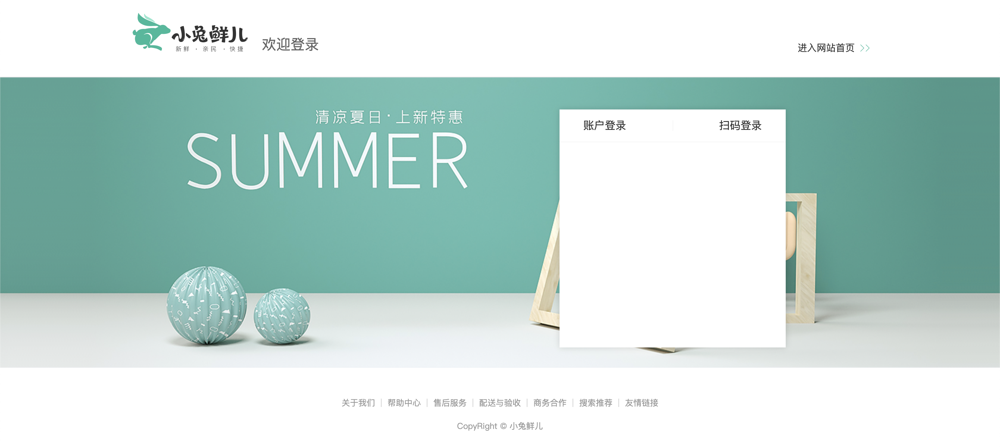

# 登录-基础布局

::: tip 目标
这一小节，我们的目标是实现登录页页面组件的基础布局

示例如下：


:::

::: warning 步骤

1. 创建登录页中的头部组件,编写布局代码
2. 在登录页头部组件中，编写样式代码
3. 创建登录页中的底部组件,编写布局代码
4. 在登录页底部组件中，编写样式代码
5. 在登录页调用头部和底部组件
6. 实现账户登录和扫码登录面板的切换效果
:::

::: info 体验

* **Step.1：创建登录页中的头部组件,编写布局代码**

```html
<template>
  <header class="login-header">
    <div class="container">
      <h1 class="logo"><RouterLink to="/">小兔鲜</RouterLink></h1>
      <h3 class="sub"><slot></slot></h3>
      <RouterLink class="entry" to="/">
        进入网站首页
        <i class="iconfont icon-angle-right"></i>
        <i class="iconfont icon-angle-right"></i>
      </RouterLink>
    </div>
  </header>
</template>
```

* **Step.2：在登录页头部组件中，编写样式代码**

```css
@import "@/assets/styles/variable.css";
.login-header {
  height: 133px;
  background: #fff;
  border-bottom: 1px solid #e4e4e4;
}
.login-header .container {
  display: flex;
  align-items: flex-end;
  justify-content: space-between;
}
.login-header .logo {
  width: 200px;
}
.login-header .logo a {
  display: block;
  height: 132px;
  width: 100%;
  text-indent: -9999px;
  background-image: url(@/assets/images/logo.png);
  background-repeat: no-repeat;
  background-position: center 18px;
  background-size: contain;
}
.login-header .sub {
  flex: 1;
  font-size: 24px;
  font-weight: normal;
  margin-bottom: 38px;
  margin-left: 20px;
  color: #666;
}
.login-header .entry {
  width: 120px;
  margin-bottom: 38px;
  font-size: 16px;
}
.login-header .entry i {
  font-size: 14px;
  color: var(--primary-color);
  letter-spacing: -5px;
}
```

* **Step.3：创建登录页中的底部组件,编写布局代码**

```html
<template>
  <footer class="login-footer">
    <div class="container">
      <p>
        <a href="javascript:">关于我们</a>
        <a href="javascript:">帮助中心</a>
        <a href="javascript:">售后服务</a>
        <a href="javascript:">配送与验收</a>
        <a href="javascript:">商务合作</a>
        <a href="javascript:">搜索推荐</a>
        <a href="javascript:">友情链接</a>
      </p>
      <p>CopyRight © 小兔鲜儿</p>
    </div>
  </footer>
</template>
```

* **Step.4：在登录页底部组件中，编写样式代码**

```css
.login-footer {
  height: 152px;
  padding: 30px 0 50px;
  background: #fff;
}
.login-footer p {
  text-align: center;
  color: #999;
  padding-top: 20px;
}
.login-footer p a {
  line-height: 1;
  padding: 0 10px;
  color: #999;
  display: inline-block;
}
.login-footer p a ~ a {
  border-left: 1px solid #ccc;
}
```

* **Step.5：在登录页调用头部和底部组件**

```html
<template>
  <LoginHeader>欢迎登录</LoginHeader>
  <section class="login-section">
    <div class="wrapper">
      <nav>
        <a href="javascript:">账户登录</a>
        <a href="javascript:">扫码登录</a>
      </nav>
      <!-- 即将放置账号登录表单组件, 此处使用div先占个位 -->
      <div class="account-box">此处即将放置账号登录表单组件</div>
      <!-- 二维码登录 -->
      <div class="qrcode-box">
        
        <p>打开 <a href="javascript:">小兔鲜App</a> 扫码登录</p>
      </div>
    </div>
  </section>
  <LoginFooter />
</template>
```

```css
@import "@/assets/styles/variable.css";

.login {
  height: 100%;
  display: flex;
  flex-direction: column;
  justify-content: space-between;
}

.login-section {
  flex: 1;
  background: url(@/assets/images/login-bg.png) no-repeat center / cover;
  height: 488px;
  position: relative;
}

.login-section .wrapper {
  width: 380px;
  background: #fff;
  min-height: 400px;
  position: absolute;
  left: 50%;
  top: 54px;
  transform: translate3d(100px, 0, 0);
  box-shadow: 0 0 10px rgba(0, 0, 0, 0.15);
}

.login-section .wrapper .qrcode-box {
  text-align: center;
  padding-top: 40px;
}

.login-section .wrapper .qrcode-box p {
  margin-top: 20px;
}

.login-section .wrapper .qrcode-box p a {
  color: var(--primary-color);
  font-size: 16px;
}

.login-section .wrapper nav {
  height: 55px;
  border-bottom: 1px solid #f5f5f5;
  display: flex;
  padding: 0 40px;
  text-align: right;
  align-items: center;
}

.login-section .wrapper nav a {
  flex: 1;
  line-height: 1;
  display: inline-block;
  font-size: 18px;
  position: relative;
}

.login-section .wrapper nav a:first-child {
  border-right: 1px solid #f5f5f5;
  text-align: left;
}

.login-section .wrapper nav a.active {
  color: var(--primary-color);
  font-weight: bold;
}
```

* **Step.6：实现账户登录和扫码登录面板的切换效果**

```js
import { ref } from "vue";

export const useToggleMethod = () => {
  const activeName = ref("account");
  const setActiveName = (name) => {
    activeName.value = name;
  };

  return { activeName, setActiveName };
};

```

```html
<section class="login-section">
      <div class="wrapper">
        <nav>
          <a
            @click="setActiveName('account')"
            :class="{ active: activeName === 'account' }"
          >
            账户登录
          </a>
          <a
            @click="setActiveName('qrcode')"
            :class="{ active: activeName === 'qrcode' }"
          >
            扫码登录
          </a>
        </nav>
        <!-- 即将放置账号登录表单组件, 此处使用div先占个位 -->
        <!-- <div v-if="activeName === 'account'" class="account-box"> -->
        <LoginForm v-if="activeName === 'account'" />
        <!-- </div> -->
        <!-- 二维码登录 -->
        <div v-if="activeName === 'qrcode'" class="qrcode-box">
          
          <p>打开 <a href="javascript:">小兔鲜App</a> 扫码登录</p>
    </div>
  </div>
</section>
```

:::

::: danger 总结

* 【重点】
* 【难点】
* 【注意点】
:::
