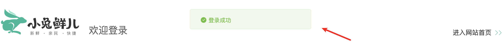

# 消息提示组件

::: tip 目标
这一小节，我们的目标是 封装消息提示组件, 供逻辑随时调用

示例如下：

:::

::: warning 步骤

1. 创建消息提示组件, 编写布局代码
2. 在消息提示组件中，编写样式代码
3. 调用消息提示组件时传递消息类型及提示信息
4. 为组件添加出场动画
5. 通过函数调用的方式渲染组件
:::

::: info 体验

* **Step.1：创建消息提示组件, 编写布局代码**

```html
<template>
  <div class="xtx-message">
    <i class="iconfont"></i>
    <span class="text">提示信息</span>
  </div>
</template>
```

```js
<script setup>
const style = {
  // 警告类型的提示
  warn: {
    icon: "icon-warning",
    color: "#E6A23C",
    backgroundColor: "rgb(253, 246, 236)",
    borderColor: "rgb(250, 236, 216)",
  },
  // 错误类型的提示
  error: {
    icon: "icon-shanchu",
    color: "#F56C6C",
    backgroundColor: "rgb(254, 240, 240)",
    borderColor: "rgb(253, 226, 226)",
  },
  // 成功类型的提示
  success: {
    icon: "icon-queren2",
    color: "#67C23A",
    backgroundColor: "rgb(240, 249, 235)",
    borderColor: "rgb(225, 243, 216)",
  },
};
</script>
```

* **Step.2：在消息提示组件中，编写样式代码**

```css
.xtx-message {
  width: 300px;
  height: 50px;
  position: fixed;
  z-index: 9999;
  left: 50%;
  margin-left: -150px;
  top: 25px;
  line-height: 50px;
  padding: 0 25px;
  border: 1px solid #e4e4e4;
  background: #f5f5f5;
  color: #999;
  border-radius: 4px;
}
.xtx-message i {
  margin-right: 4px;
  vertical-align: middle;
}
.xtx-message .text {
  vertical-align: middle;
}
```

* **Step.3：调用消息提示组件时传递消息类型及提示信息**

```js
defineProps({
  // 消息提示类型 warn、error、success
  type: {
    type: String,
    default: "error",
  },
  // 消息提示内容
  text: {
    type: String,
    default: "",
  },
});
```

```html
<template>
 <div class="xtx-message" :style="style[type]">
    <i class="iconfont" :class="style[type].icon"></i>
    <span class="text">{{ text }}</span>
  </div>
</template>
```

```html
<Message type="success" text="登录成功" />
```

* **Step.4：为组件添加出场动画**

```html
<Transition name="down">
    <div class="xtx-message" :style="style[type]" v-if="show"></div>
</Transition>
```

```js
import { onMounted, ref } from 'vue'

    // 元素要想执行动画, 必须有渲染行为
    // 默认不渲染元素
    const show = ref(false);
    // 组件挂载完成后渲染元素
    onMounted(() => (show.value = true));
```

```css
.down-enter-from {
  transform: translate3d(0, -75px, 0);
  opacity: 0;
}
.down-enter-active {
  transition: all 0.5s;
}
.down-leave-to {
  transform: translate3d(0, -75px, 0);
  opacity: 0;
}
.down-leave-active {
  transition: all 0.5s;
}
```

* **Step.5：通过函数调用的方式渲染组件**
  通过函数调用的方式渲染组件可以决定将组件渲染到哪, 可以决定什么时候渲染组件。

```js
// 1. 导入单文件组件对象
// 2. 将单文件组件转换为虚拟节点对象
// 3. 将虚拟节点对象渲染到真实DOM中
// 4. 3秒后销毁组件

// 1. 导入单文件组件对象
import XtxMessage from "@/components/library/XtxMessage";
import { createVNode, render } from "vue";

// 创建组件渲染的目标容器
const container = document.createElement("div");
document.body.appendChild(container);
// 用于存定时器
let timer = null;

// 用于渲染组件的方法
export default function Message({ type, text }) {
  // 2. 将单文件组件转换为虚拟节点对象
  const vNode = createVNode(XtxMessage, { type, text });
  // 3. 将虚拟节点对象渲染到真实DOM中
  render(vNode, container);
  // 4. 3秒后销毁组件
  clearTimeout(timer);
  // 延迟3秒
  timer = setTimeout(() => {
    // 销毁组件
    vNode.component.proxy.show = false;
    // 重置DOM对象 清除_vnode属性
    container._vnode = null;
  }, 3000);
}
```

```js
import Message from "@/components/library/Message";

export default {
  setup () {
    const showMessage = () => {
      Message({ type: "success", text: "登录成功" });
    }
    return { showMessage }
  }
}
```

```html
<button @click="showMessage">showMessage</button>
```

:::

::: danger 总结

* 【重点】
* 【难点】
* 【注意点】
:::
