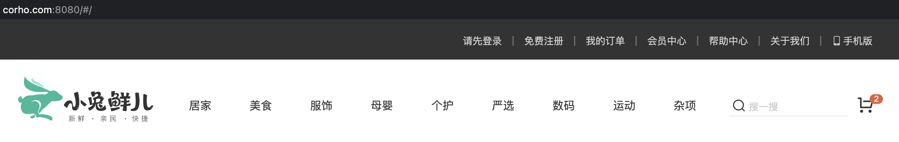

# QQ登录-准备工作

::: tip 目标
这一小节，我们的目标是 完成登录前在本机的准备工作
:::

::: warning 步骤

1. 回顾域名解析过程
2. 修改本机 host 文件进行域名解析工作
3. 禁用域名检查
:::

::: info 体验
[QQ互联准备工作的参考文档](https://wiki.connect.qq.com/%E5%87%86%E5%A4%87%E5%B7%A5%E4%BD%9C_oauth2-0)

[接入QQ互联参考文档](https://wiki.connect.qq.com/js_sdk%E4%BD%BF%E7%94%A8%E8%AF%B4%E6%98%8E)

* 小兔仙应用上线 (可以通过域名的方式进行应用的访问)
* 在QQ互联上进行开发者身份验证 (需要审核通过才能继续向下)
* 在QQ互联上创建应用，填写域名、备案号、QQ登录授权后应用的回跳地址
* 创建成功后应用会有一个在QQ互联中的唯一标识 `appid`

要实现QQ登录, 我们的小兔仙应用需要可以通过网络域名的方式进行访问.

实际上我们已经在QQ互联中注册了小兔仙应用，填入的回调地址是 `http://www.corho.com:8080/#/login/callback`，为了在本地开发环境中完成开发工作我们要做的是，在跳转到以上地址时，将以上域名解析为 `127.0.0.1`，即对应到我们本地的小兔仙应用。也就是说，当访问以上域名时，访问的实际上就是我们本地开发环境中的小兔仙应用。

回顾域名解析过程

```bash
# 测试用appid 
# 100556005
# 测试用redirect_uri
# http://www.corho.com:8080/#/login/callback
```

修改本机 host 文件进行域名解析工作

`windows`

```text
1. 找到 C:\Windows\System32\drivers\etc 下hosts文件
2. 在文件中加入  127.0.0.1       www.corho.com
3. 保存即可。
# 如果提示没有权限
1. 将hosts文件移到桌面，然后进行修改，确认保存。
2. 将桌面hosts文件替换c盘文件
```

`mac OS`

```text
1. 打开命令行窗口
2. 输入：sudo vim /etc/hosts
3. 按下：i 键
4. 输入：127.0.0.1       www.corho.com
5. 按下：esc
6. 按下：shift + :
7. 输入：wq 回车即可
```


修改了域名解析规则以后我们发现仍然访问不到本地小兔仙应用，这是因为本机的 Vue 应用是运行在 webpack-dev-server 开启的服务器下的，这个服务器默认会有一个访问地址检查，如果是本机访问，即 `localhost` 访问，这是允许的，如果是通过其他域名访问，禁止。所以接下来我们要做的事情就是关闭这个检查。

```js
// vue.config.js
chainWebpack: config => {
  // 禁用域名检查
  config.devServer.disableHostCheck(true)
}
```



:::

::: danger 总结

* 【重点】
* 【难点】
* 【注意点】
:::
