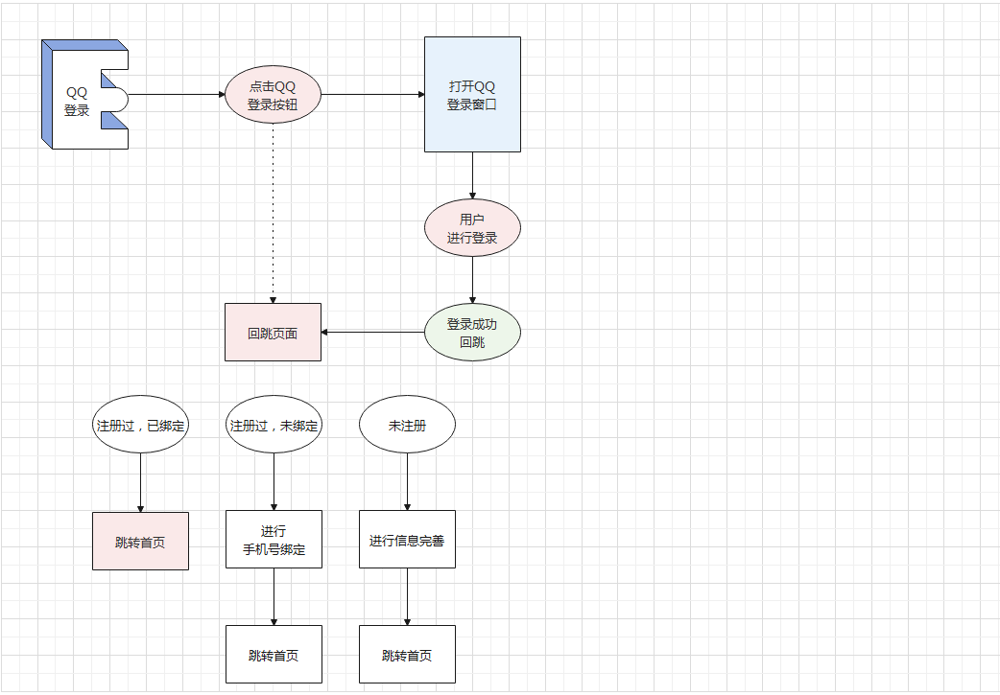

# QQ登录-流程分析

::: tip 目标
这一小节，我们的目标是了解QQ登录的流程
:::

::: warning 步骤

1. 介绍
2. 流程介绍
:::

::: info 体验

* **Step.1：介绍**

  QQ登录就是为站点添加的一种快捷登录方式, 当用户想要登录站点的时候, 可以使用QQ扫码进行登录。

  1. 省去了输入用户名和密码的过程。
  2. 就算用户忘记了站点的注册账号和密码也可以登录。

  用户要使用QQ登录, 前提是已经在本站点注册了账号, 使用站点账号和QQ号进行绑定, 绑定以后就可以使用QQ扫码进行登录了。

* **Step.2：流程图**

  

  描述一下我们要做的事情：

  * 在小兔仙应用的登录页面, 生成 QQ 登录按钮
  * 在 QQ 登录授权成功后的回跳页面中, 获取 QQ 用户的唯一标识 (openid)
  * 在小兔仙应用中向服务器端发送请求根据 openid 查询用户
  * 如果能够通过 openid 查询到用户, 说明该 QQ 已经和本站点中的账号进行绑定, 直接跳转到首页, 表明该用户已经登录成功
  * 如果不能够通过 openid 查询到用户, 则有以下两种场景供用户自己选择
    * 使用已有站点账号和 QQ 号进行绑定, 绑定成功后, 跳转到首页, 表明登录成功
    * 注册一个新的站点账号, 使用新的站点账号和 QQ 号进行绑定, 绑定成功后, 跳转到首页, 表明登录成功
:::

::: danger 总结

* 【重点】
* 【难点】
* 【注意点】
:::
