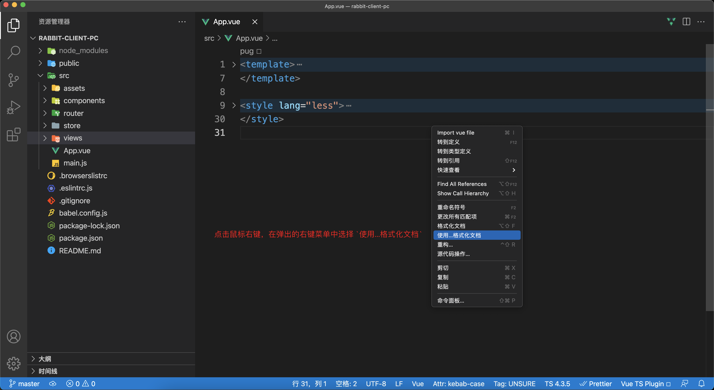

# 编辑器配置

::: tip 目标
这一小节，我们的目标是安装编辑器插件、配置编辑器，了解每个插件的作用及使用方式
:::

::: warning 步骤

1. 安装并配置ESLint
2. 安装并配置Prettier
3. 设置jsconfig
:::

::: info 体验

* **Kn.1： 安装并配置ESLint**

  安装 VSCode 插件 [ESLint](https://marketplace.visualstudio.com/items?itemName=dbaeumer.vscode-eslint), 避免代码中出现低级bug，找出可能发生的语法错误。
  
  比如调用了一个需要传递参数的函数而参数却没有传递, 使用了一个没有声明的变量或方法, 尝试修改使用 const 创建的常量, 检测是否存在永远都不会得到执行的代码块.

  

* **Kn.2： 安装并配置Prettier**

  安装 VScode 插件 [Prettier](https://marketplace.visualstudio.com/items?itemName=esbenp.prettier-vscode), 该插件用于代码格式化, 使代码实时保持良好的可阅读状态。

  

  将 Prettier 设置为编辑器默认的代码格式化工具

  

  选择默认的方式

  

* **Kn.3： 设置jsconfig**

  通过 jsconfig 文件实现 `@/`路径的代码提示。

  ```js
  import something from '../../../../../utils/something';
  import something from '@/utils/something;
  ```

  通过配置使 "@/" 后面产生路由提示。

  在应用的根目录下创建 `jsconfig.json` 文件并添加以下内容

  ```json
  {
     "compilerOptions": {
       "baseUrl": ".",
       "paths": {
         "@/*": ["./src/*"],
       }
     },
     "exclude": [
       "node_modules",
       "dist"
     ]
  }
  ```

  baseUrl: 指定项目的根目录, 当导入的模块使用绝对路径时, baseUrl 选项指定的路径就是绝对路径的开始位置。

  paths: 基于 baseUrl 选项配置路径别名

  配置完成后重启 VSCode

:::

::: danger 总结

* 【重点】
* 【难点】
* 【注意点】
:::
