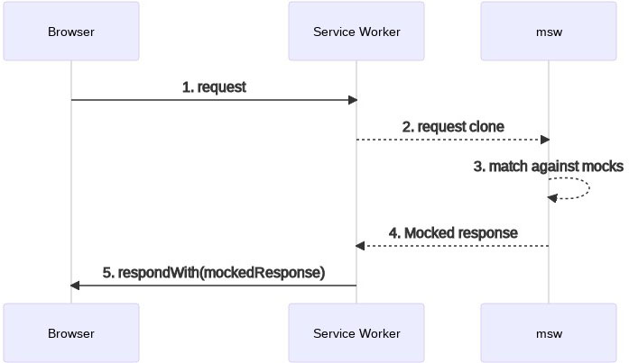

# Mock Service Worker

::: tip Object
这一小节，我们的目标是掌握 Mock Service Worker 的基本使用方式
:::

::: warning Path

1. MSW的执行过程
2. MSW的使用方式
:::

::: info Experience

* **Step.1：MSW的执行过程**

[Mock Service Worker](https://mswjs.io/): 在网络级别上对请求进行拦截, 对请求进行自定义处理.



* **Step.2：MSW的使用方式**

  * ⓵ 下载指定版本的请求拦截工具

  ```bash
  npm install msw@0.35.0
  ```

  * ⓶ 生成 service worker 的注册文件
  
  以下命令运行后会在 public 文件夹下生成 `mockServiceWorker.js`, 在每一个项目中生成的文件代码都是一样的. 不需关心.

  ```bash
  npx msw init public/
  ```

  * ⓷ 编写并配置请求拦截程序

  ```js
  // mocks/worker.js
  import { rest, setupWorker } from "msw";
  import { baseURL } from "@/utils/request";

  const worker = setupWorker(
    rest.get(`${baseURL}message`, (req, res, ctx) => {
      return res(ctx.json({ msg: "hello" }));
    })
  );

  export default worker;
  ```

  * ⓸ 启动请求拦截

  ```js
  // 判断当前是否为开发环境
  if (process.env.NODE_ENV === "development") {
    // 动态引入请求拦截实例对象
    import("./mocks/worker").then(async ({ default: worker }) => {
      // 启动请求拦截实用程序
      // onUnhandledRequest: 拦截到未处理的请求走该函数
      // quiet: true 安静模式, 对于拦截成功的请求不要在控制台中进行输出提示
      await worker
        .start({ onUnhandledRequest() {} })
        .then(() => console.log("%c拦截程序启动成功", "color: green"));
      app.mount("#app");
    });
  }
  ```

  * ⓹ 配置 环境变量

  ```js
  // vite.config.js
  define: {
     "process.env": {
       BASE_URL: "http://pcapi-xiaotuxian-front-devtest.itheima.net/",
       NODE_ENV: "development",
     },
  },
  ```

:::

::: danger Note

* 【重点】
* 【难点】
* 【注意点】
:::
