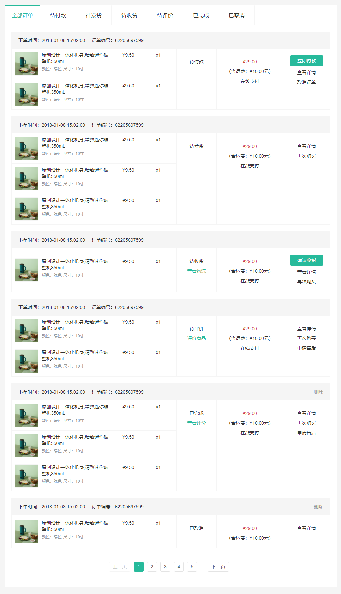

# 订单管理-列表渲染

::: tip Object
这一小节，我们的目标是完成订单列表默认渲染

示例如下:

:::

::: warning Path

1. 创建用于获取订单列表的API接口函数
2. 在订单列表组件中获取订单列表数据
3. 提取订单列表项组件
4. 在订单列表组件中调用订单列表项组件
5. 渲染订单列表数据
:::

::: info Experience

* **Step.1：创建用于获取订单列表的API接口函数**

```js
/**
 * 获取订单列表
 * @param page 页码
 * @param pageSize 每页显示多少数据
 * @param orderState 订单状态 0为全部 1为待付款、2为待发货、3为待收货、4为待评价、5为已完成、6为已取
 * @return {Promise}
 */
export function getOrderList({ page, pageSize, orderState }) {
  return request("/member/order", "get", { page, pageSize, orderState });
}
```

* **Step.2：在订单列表组件中获取订单列表数据**

```js
import { ref, watch } from "vue";
import { getOrderList } from "@/api/member";

export default {
  setup() {
    // 获取订单列表数据
    const { orderList } = useOrderList();
    return { orderList };
  },
};
// 获取订单列表数据
function useOrderList() {
  // 用于存储订单列表数据
  const orderList = ref(null);
  // 请求参数
  const reqParams = ref({ page: 1, pageSize: 10, orderState: 0 });
  // 获取并存储订单列表数据
  const getData = () => {
    getOrderList(reqParams.value).then(
      (data) => (orderList.value = data.result)
    );
  };
  // 监控请求参数变化, 重新获取订单列表数据
  watch(reqParams.value, () => getData(), { immediate: true });
  return { orderList, reqParams };
}
```

* **Step.3：提取订单列表项组件**

```html
<!-- OrderItem -->
<template>
  <div class="order-item">
    <div class="head">
      <span>下单时间：2021-09-25 08:33:30</span>
      <span>订单编号：1441561463234760705</span>
      <span class="down-time">
        <i class="iconfont icon-down-time"></i>
        <b>付款截止：28分32秒</b>
      </span>
      <a href="javascript:" class="del">删除</a>
    </div>
    <div class="body">
      <div class="column goods">
        <ul>
          <li v-for="i in 2" :key="i">
            <a class="image" href="javascript:">
              
            </a>
            <div class="info">
              <p class="name ellipsis-2">
                不烫手的茶杯双层隔热茶水杯绿茶杯
              </p>
              <p class="attr ellipsis">
                <span>容量:2只装 </span>
              </p>
            </div>
            <div class="price">¥89</div>
            <div class="count">x1</div>
          </li>
        </ul>
      </div>
      <div class="column state">
        <p>待付款</p>
        <a href="javascript:" class="green">查看物流</a>
        <a href="javascript:" class="green">评价商品</a>
        <a href="javascript:" class="green">查看评价</a>
      </div>
      <div class="column amount">
        <p class="red">¥93</p>
        <p>（含运费：¥4）</p>
        <p>在线付款</p>
      </div>
      <div class="column action">
        <XtxButton type="primary" size="small">立即付款</XtxButton>
        <XtxButton type="primary" size="small">确认收货</XtxButton>
        <p><a href="javascript:">查看详情</a></p>
        <p><a href="javascript:">取消订单</a></p>
        <p><a href="javascript:">再次购买</a></p>
        <p><a href="javascript:">申请售后</a></p>
      </div>
    </div>
  </div>
</template>
```

```css
.order-item {
  margin-bottom: 20px;
  border: 1px solid #f5f5f5;
}
.order-item .head {
  height: 50px;
  line-height: 50px;
  background: #f5f5f5;
  padding: 0 20px;
  overflow: hidden;
}
.order-item .head span {
  margin-right: 20px;
}
.order-item .head span.down-time {
  margin-right: 0;
  float: right;
}
.order-item .head span.down-time i {
  vertical-align: middle;
  margin-right: 3px;
}
.order-item .head span.down-time b {
  vertical-align: middle;
  font-weight: normal;
}
.order-item .head .del {
  margin-right: 0;
  float: right;
  color: #999;
}
.order-item .body {
  display: flex;
  align-items: stretch;
}
.order-item .body .column {
  border-left: 1px solid #f5f5f5;
  text-align: center;
  padding: 20px;
}
.order-item .body .column > p {
  padding-top: 10px;
}
.order-item .body .column:first-child {
  border-left: none;
}
.order-item .body .column.goods {
  flex: 1;
  padding: 0;
  align-self: center;
}
.order-item .body .column.goods ul li {
  border-bottom: 1px solid #f5f5f5;
  padding: 10px;
  display: flex;
}
.order-item .body .column.goods ul li:last-child {
  border-bottom: none;
}
.order-item .body .column.goods ul li .image {
  width: 70px;
  height: 70px;
  border: 1px solid #f5f5f5;
}
.order-item .body .column.goods ul li .info {
  width: 220px;
  text-align: left;
  padding: 0 10px;
}
.order-item .body .column.goods ul li .info p {
  margin-bottom: 5px;
}
.order-item .body .column.goods ul li .info p.name {
  height: 38px;
}
.order-item .body .column.goods ul li .info p.attr {
  color: #999;
  font-size: 12px;
}
.order-item .body .column.goods ul li .info p.attr span {
  margin-right: 5px;
}
.order-item .body .column.goods ul li .price {
  width: 100px;
}
.order-item .body .column.goods ul li .count {
  width: 80px;
}
.order-item .body .column.state {
  width: 120px;
}
.order-item .body .column.state .green {
  color: #27BA9B;
}
.order-item .body .column.amount {
  width: 200px;
}
.order-item .body .column.amount .red {
  color: #CF4444;
}
.order-item .body .column.action {
  width: 140px;
}
.order-item .body .column.action a {
  display: block;
}
.order-item .body .column.action a:hover {
  color: #27BA9B;
}
```

* **Step.4：在订单列表组件中调用订单列表项组件**

```html
<div class="order-list" v-if="orderList">
  <OrderItem :order="item" v-for="item in orderList.items" :key="item.id" />
</div>
```

* **Step.5：渲染订单列表数据**

```html
<template>
  <div class="order-item">
    <div class="head">
      <span>下单时间：{{ order.createTime }}</span>
      <span>订单编号：{{ order.id }}</span>
      <span class="down-time" v-if="order.orderState === 1 && order.countdown !== -1">
        <i class="iconfont icon-down-time"></i>
        <b>付款截止：{{timeText}}</b>
      </span>
      <!-- 订单状态为 已完成(5)或已取消(6)时可以删除订单 -->
      <a
        v-if="[5, 6].includes(order.orderState)"
        href="javascript:;"
        class="del"
        >删除</a
      >
    </div>
    <div class="body">
      <div class="column goods">
        <ul>
          <li v-for="goods in order.skus" :key="goods.id">
            <router-link class="image" :to="`/product/${goods.spuId}`">
              
            </router-link>
            <div class="info">
              <p class="name ellipsis-2">
                {{ goods.name }}
              </p>
              <p class="attr ellipsis">
                {{ goods.attrsText }}
              </p>
            </div>
            <div class="price">¥{{ goods.realPay }}</div>
            <div class="count">x{{ goods.quantity }}</div>
          </li>
        </ul>
      </div>
      <div class="column state">
        <!-- orderStatus是一个数组, 数组的索引和订单状态值是对应关系 -->
        <p>
          {{ orderStatus[order.orderState].label }}
        </p>
        <p v-if="order.orderState === 3">
          <a href="javascript:;" class="green">查看物流</a>
        </p>
        <p v-if="order.orderState === 4">
          <a href="javascript:;" class="green">评价商品</a>
        </p>
        <p v-if="order.orderState === 5">
          <a href="javascript:;" class="green">查看评价</a>
        </p>
      </div>
      <div class="column amount">
        <p class="red">¥{{ order.payMoney }}</p>
        <p>（含运费：¥{{ order.postFee }}）</p>
        <p>在线支付</p>
      </div>
      <div class="column action">
        <XtxButton
          @click="$router.push(`/member/pay?orderId=${order.id}`)"
          type="primary"
          size="small"
          v-if="order.orderState === 1"
          >立即付款</XtxButton
        >
        <XtxButton v-if="order.orderState === 3" type="primary" size="small"
          >确认收货</XtxButton
        >
        <p>
          <RouterLink :to="`/member/order/${order.id}`">查看详情</RouterLink>
        </p>
        <p v-if="order.orderState === 1"><a href="javascript:;">取消订单</a></p>
        <p v-if="[2, 3, 4, 5].includes(order.orderState)">
          <a href="javascript:;">再次购买</a>
        </p>
        <p v-if="[4, 5].includes(order.orderState)">
          <a href="javascript:;">申请售后</a>
        </p>
      </div>
    </div>
  </div>
</template>
<script>
import { orderStatus } from '@/api/constants'
export default {
  setup (props) {
    // 获取倒计时
    const { timeText, start } = useCountDown()
    // 如果当前订单为待付款
    if (props.order.orderState === 1) {
      // 开启计时器
      start(props.order.countdown)
    }
    return { orderStatus, timeText, start }
  }
}
</script>
```

```text
倒计时: 待付款 (1)
删除: 已完成、已取消 (5)(6)

订单状态下面的链接: 
查看物流: 待收货 (3)
评价商品: 待评价 (4)
查看评价: 已完成 (5)

立即付款: 待付款 (1)
确认收货: 待收货 (3)
取消订单: 待付款 (1)
再次购买: 待发货 (2)、待收货 (3)、待评价 (4)、已完成 (5)
申请售后: 待评价 (4)、已完成 (5)
查看详情: 所有状态 (1) (2) (3) (4) (5) (6)

商品发货: GET `http://pcapi-xiaotuxian-front-devtest.itheima.net/member/order/consignment/1394116427400613890`

确认收货: PUT Authorization `http://pcapi-xiaotuxian-front-devtest.itheima.net/member/order/1440512972257497090/receipt`
```

:::

::: danger Note

* 【重点】
* 【难点】
* 【注意点】
:::
