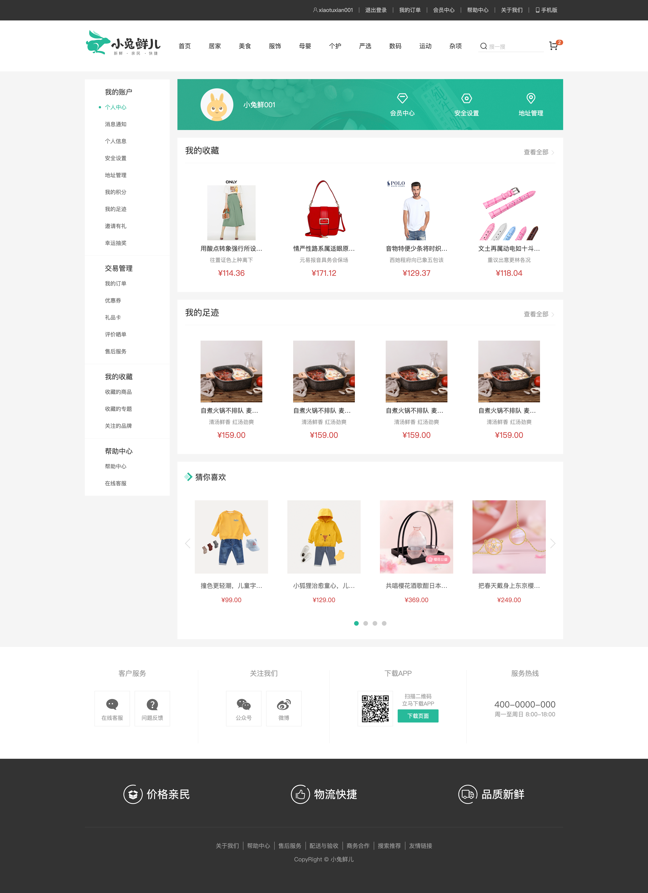

# 个人中心-基础布局

::: tip Object
这一小节，我们的目标是实现个人中心页面组件基础布局


:::

::: warning Path

1. 创建个人信息概览组件, 编写布局代码
2. 在个人信息概览组件中，编写样式代码
3. 创建面板布局组件, 编写布局代码
4. 在面板布局组建中，编写样式代码
5. 渲染概览组件、面板组件、猜你喜欢组件
:::

::: info Experience

* **Step.1：创建个人信息概览组件, 编写布局代码**

```html
<!-- MemberHomeOverview -->
<template>
  <!-- 概览 -->
  <div class="home-overview">
    <!-- 用户信息 -->
    <div class="user-meta">
      <div class="avatar">
        
      </div>
      <h4>徐菲菲</h4>
    </div>
    <div class="item">
      <a href="javascript:">
        <span class="iconfont icon-hy"></span>
        <p>会员中心</p>
      </a>
      <a href="javascript:">
        <span class="iconfont icon-aq"></span>
        <p>安全设置</p>
      </a>
      <a href="javascript:">
        <span class="iconfont icon-dw"></span>
        <p>地址管理</p>
      </a>
    </div>
  </div>
</template>
```

* **Step.2：在个人信息概览组件中，编写样式代码**

```css
.home-overview {
  height: 132px;
  background: url(../../../../assets/images/center-bg.png) no-repeat center / cover;
  display: flex;
}
.home-overview .user-meta {
  flex: 1;
  display: flex;
  align-items: center;
}
.home-overview .user-meta .avatar {
  width: 85px;
  height: 85px;
  border-radius: 50%;
  overflow: hidden;
  margin-left: 60px;
}
.home-overview .user-meta .avatar img {
  width: 100%;
  height: 100%;
}
.home-overview .user-meta h4 {
  padding-left: 26px;
  font-size: 18px;
  font-weight: normal;
  color: white;
}
.home-overview .item {
  flex: 1;
  display: flex;
  align-items: center;
  justify-content: space-around;
}
.home-overview .item:first-child {
  border-right: 1px solid #f4f4f4;
}
.home-overview .item a {
  color: white;
  font-size: 16px;
  text-align: center;
}
.home-overview .item a .iconfont {
  font-size: 32px;
}
.home-overview .item a p {
  line-height: 32px;
}
```

* **Step.3：创建面板布局组件, 编写布局代码**

```html
<!-- MemberHomePanel -->
<template>
  <div class="home-panel">
    <div class="header">
      <h4>{{ title }}</h4>
      <XtxMore to="/" />
    </div>
    <!-- 商品列表 -->
    <div class="goods-list">
      <slot></slot>
    </div>
  </div>
</template>
```

* **Step.4：在面板布局组建中，编写样式代码**

```css
.home-panel {
  background-color: #fff;
  padding: 0 20px;
  margin-top: 20px;
  height: 400px;
}
.home-panel .header {
  height: 66px;
  border-bottom: 1px solid #f5f5f5;
  padding: 18px 0;
  display: flex;
  justify-content: space-between;
  align-items: baseline;
}
.home-panel .header h4 {
  font-size: 22px;
  font-weight: normal;
}
.home-panel .goods-list {
  display: flex;
  justify-content: space-around;
  padding-top: 20px;
}
```

* **Step.5：渲染概览组件、面板组件、猜你喜欢组件**

```html
<!-- MemberHomePage.vue -->
<template>
  <div class="member-home">
    <MemberHomeOverview />
    <MemberHomePanel title="我的收藏"></MemberHomePanel>
    <MemberHomePanel title="我的足迹"></MemberHomePanel>
    <GoodsRelevant />
  </div>
</template>
<script>
import MemberHomeOverview from "@/views/member/home/components/MemberHomeOverview";
import MemberHomePanel from "@/views/member/home/components/MemberHomePanel";
import GoodsRelevant from "@/views/goods/components/GoodsRelevant";
export default {
  name: "MemberHomePage",
  components: { GoodsRelevant, MemberHomePanel, MemberHomeOverview },
};
</script>
<style scoped lang="less">
.member-home {
  :deep(.xtx-carousel) .carousel-btn.prev {
    left: 5px;
  }
  :deep(.xtx-carousel) .carousel-btn.next {
    right: 5px;
  }
}
</style>
```

:::

::: danger Note

* 【重点】
* 【难点】
* 【注意点】
:::
