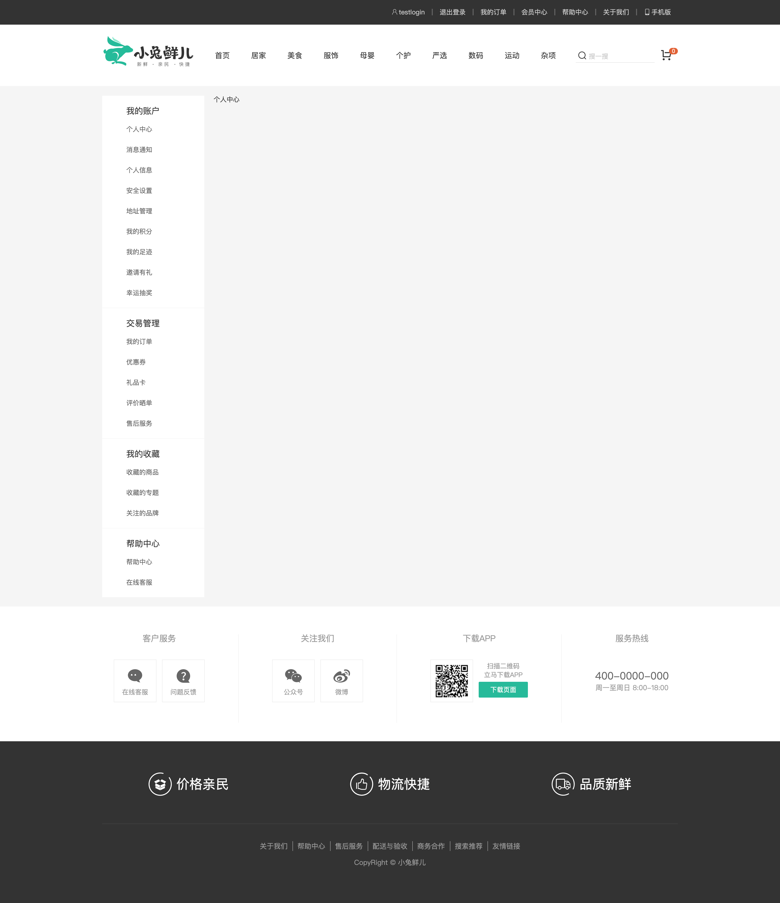

# 个人中心-布局容

::: tip Object
这一小节，我们的目标是 完成个人中心页面基础布局结构，配置路由。

示例如下:

:::

::: warning Path

1. 创建个人中心左侧菜单组件, 编写布局代码
2. 在个人中心左侧菜单组件中，编写样式代码
3. 创建个人中心布局组件, 编写布局代码
4. 在个人中心布局组建中，编写样式代码
5. 创建个人中心首页组件
6. 配置个人中心布局组件路由规则
7. 配置个人中心首页页面路由规则
8. 在顶部通栏组件中添加跳转到个人中心的链接地址
:::

::: info Experience

* **Step.1：创建个人中心左侧菜单组件, 编写布局代码**

```html
<!-- AppMemberSidebar -->
<template>
  <div class="xtx-member-aside">
    <div class="user-manage">
      <h4>我的账户</h4>
      <div class="links">
        <a href="javascript:">个人中心</a>
        <a href="javascript:">消息通知</a>
        <a href="javascript:">个人信息</a>
        <a href="javascript:">安全设置</a>
        <a href="javascript:">地址管理</a>
        <a href="javascript:">我的积分</a>
        <a href="javascript:">我的足迹</a>
        <a href="javascript:">邀请有礼</a>
        <a href="javascript:">幸运抽奖</a>
      </div>
      <h4>交易管理</h4>
      <div class="links">
        <a href="javascript:">我的订单</a>
        <a href="javascript:">优惠券</a>
        <a href="javascript:">礼品卡</a>
        <a href="javascript:">评价晒单</a>
        <a href="javascript:">售后服务</a>
      </div>
      <h4>我的收藏</h4>
      <div class="links">
        <a href="javascript:">收藏的商品</a>
        <a href="javascript:">收藏的专题</a>
        <a href="javascript:">关注的品牌</a>
      </div>
      <h4>帮助中心</h4>
      <div class="links">
        <a href="javascript:">帮助中心</a>
        <a href="javascript:">在线客服</a>
      </div>
    </div>
  </div>
</template>
```

* **Step.2：在个人中心左侧菜单组件中，编写样式代码**

```css
.xtx-member-aside {
  width: 220px;
  margin-right: 20px;
  border-radius: 2px;
}
.xtx-member-aside .user-manage {
  background-color: #fff;
}
.xtx-member-aside .user-manage h4 {
  font-size: 18px;
  font-weight: 400;
  padding: 20px 52px 5px;
  border-top: 1px solid #f6f6f6;
}
.xtx-member-aside .user-manage .links {
  padding: 0 52px 10px;
}
.xtx-member-aside .user-manage a {
  display: block;
  line-height: 1;
  padding: 15px 0;
  font-size: 14px;
  color: #666;
  position: relative;
}
.xtx-member-aside .user-manage a:hover {
  color: #27BA9B;
}
.xtx-member-aside .user-manage a.exact-active {
  color: #27BA9B;
}
.xtx-member-aside .user-manage a.exact-active:before {
  display: block;
}
.xtx-member-aside .user-manage a.fuzzy-active {
  color: #27BA9B;
}
.xtx-member-aside .user-manage a.fuzzy-active:before {
  display: block;
}
.xtx-member-aside .user-manage a:before {
  content: "";
  display: none;
  width: 6px;
  height: 6px;
  border-radius: 50%;
  position: absolute;
  top: 19px;
  left: -16px;
  background-color: #27BA9B;
}
```

* **Step.3：创建个人中心布局组件, 编写布局代码**

```html
<!-- AppMemberLayout.vue -->
<template>
  <AppLayout>
    <div class="container">
      <AppMemberSidebar />
      <article class="article">
        <slot />
      </article>
    </div>
  </AppLayout>
</template>
```

* **Step.4：在个人中心布局组建中，编写样式代码**

```css
.container {
  display: flex;
  padding-top: 20px;
}
.container .article {
  width: 1000px;
  position: relative;
}
```

* **Step.5：创建个人中心首页组件**

```html
<!-- MemberHomePage -->
<template>
  <AppMemberLayout> 个人中心首页 </AppMemberLayout>
</template>
<script>
import AppMemberLayout from "@/components/AppMemberLayout";
</script>
```

* **Step.6：配置个人中心布局组件路由规则**
* **Step.7：配置个人中心首页页面路由规则**

```js
const MemberHomePage = () => import("@/views/member/MemberHomePage");

const routes = [
  {
    path: "/member/home",
    component: MemberHomePage,
  },
];
```

* **Step.8：在顶部通栏组件中添加跳转到个人中心的链接地址**

```html
<RouterLink to="/member/home">
    <i class="iconfont icon-user"></i>
    {{ user.profile.account }}
</RouterLink>
```

:::

::: danger Note

* 【重点】
* 【难点】
* 【注意点】
:::
