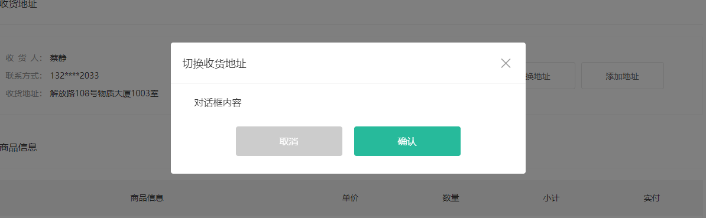

# 结算-对话框组件封装

::: tip 目标
这一小节，我们的目标是封装对话框组件, 实现基础布局, 实现对话框组件的渲染与销毁

示例如下:

:::

::: warning 步骤

1. 创建对话框组件, 编写布局代码
2. 在对话框组件中，编写样式代码
3. 实现对话框组件内容动态化
4. 实现对话框组件的渲染与销毁
:::

::: info 体验

* **Step.1：创建对话框组件, 编写布局代码**

```html
<template>
  <div class="xtx-dialog">
    <div class="wrapper">
      <div class="header">
        <h3>切换收货地址</h3>
        <a href="JavaScript:" class="iconfont icon-close-new"></a>
      </div>
      <div class="body">对话框内容</div>
      <div class="footer">
        <Button type="gray" style="margin-right: 20px">取消</Button>
        <Button type="primary">确认</Button>
      </div>
    </div>
  </div>
</template>
```

* **Step.2：在对话框组件中，编写样式代码**

```css
@import "@/assets/styles/variable.css";
.xtx-dialog {
  position: fixed;
  left: 0;
  top: 0;
  width: 100%;
  height: 100%;
  z-index: 8887;
  background: rgba(0, 0, 0, 0);
}
.xtx-dialog.fade {
  transition: all 0.4s;
  background: rgba(0, 0, 0, 0.5);
}
.xtx-dialog .wrapper {
  width: 600px;
  background: #fff;
  border-radius: 4px;
  position: absolute;
  top: 50%;
  left: 50%;
  transform: translate(-50%, -60%);
  opacity: 0;
}
.xtx-dialog .wrapper.fade {
  transition: all 0.4s;
  transform: translate(-50%, -50%);
  opacity: 1;
}
.xtx-dialog .wrapper .body {
  padding: 20px 40px;
  font-size: 16px;
}
.xtx-dialog .wrapper .body .icon-warning {
  color: var(--price-color);
  margin-right: 3px;
  font-size: 16px;
}
.xtx-dialog .wrapper .footer {
  text-align: center;
  padding: 10px 0 30px 0;
}
.xtx-dialog .wrapper .header {
  position: relative;
  height: 70px;
  line-height: 70px;
  padding: 0 20px;
  border-bottom: 1px solid #f5f5f5;
}
.xtx-dialog .wrapper .header h3 {
  font-weight: normal;
  font-size: 18px;
}
.xtx-dialog .wrapper .header a {
  position: absolute;
  right: 25px;
  top: 25px;
  font-size: 24px;
  width: 20px;
  height: 20px;
  line-height: 20px;
  text-align: center;
  color: #999;
}
.xtx-dialog .wrapper .header a:hover {
  color: #666;
}
```

* **Step.3：实现对话框组件内容动态化**

```html
<!-- 测试代码 -->
<Dialog title="对话框标题">
  <template v-slot:default> 对话框中的提示信息 </template>
  <template v-slot:footer>
    <Button type="gray" style="margin-right: 20px">取消</Button>
    <Button type="primary">确认</Button>
  </template>
</Dialog>
```

```js
const props = defineProps({
  title: {
    type: String,
    default: "",
  },
});
```

```html
<template>
  <div class="xtx-dialog">
    <div class="wrapper">
      <div class="header">
        <h3>{{ title }}</h3>
        <a href="JavaScript:" class="iconfont icon-close-new"></a>
      </div>
      <div class="body">对话框内容</div>
      <div class="footer">
        <Button type="gray" :size="small" style="margin-right: 20px"
          >取消</Button
        >
        <Button type="primary" :size="small">确认</Button>
      </div>
    </div>
  </div>
</template>
```

* **Step.4：实现对话框组件的渲染与销毁**

```js
import { useVModel } from "@vueuse/core";

<script setup>
import { useVModel } from "@vueuse/core";
import Button from "../Button/Button.vue";
const props = defineProps({
  title: {
    type: String,
    default: "",
  },
  visible: {
    type: Boolean,
    default: false,
  },
});

// 控制弹框是否渲染
const isRendering = useVModel(props, "visible", emit);

// 渲染弹框
const render = () => {
  isRendering.value = true;
};

// 销毁弹框
const destroy = () => {
  isRendering.value = false;
};

// 注册一个局部的自定义指令，需要以小写v开头
const vFocus = {
  mounted(el) {
    // 获取input，并调用其focus()方法
    requestAnimationFrame(() => {
      el.classList.add("fade");
    });
  },
};
```

```html
<template>
  <div class="xtx-dialog" v-if="isRendering" v-fade>
    <div class="wrapper">
      <div class="header">
        <h3>{{ title }}</h3>
        <a href="JavaScript:" class="iconfont icon-close-new"></a>
      </div>
      <div class="body">对话框内容</div>
      <div class="footer">
        <Button
          type="gray"
          :size="small"
          style="margin-right: 20px"
          @click="destroy"
          >取消</Button
        >
        <Button type="primary" :size="small">确认</Button>
      </div>
    </div>
  </div>
</template>
```

```html
<!-- 测试代码 -->
<template>
    <XtxDialog v-model:visible="visible" ref="xtxDialogInstance">
    <XtxButton @click="xtxDialogInstance.destroy()">取消</XtxButton>
  </XtxDialog>
</template>
<script>
export default {
  setup() {
    const visible = ref(false);
    const xtxDialogInstance = ref(null);
    return { visible, xtxDialogInstance };
  },
};
</script>
```

:::

::: danger 总结

* 【重点】
* 【难点】
* 【注意点】
:::
